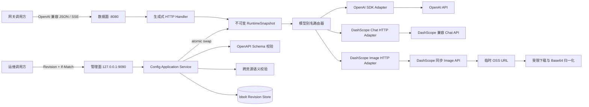
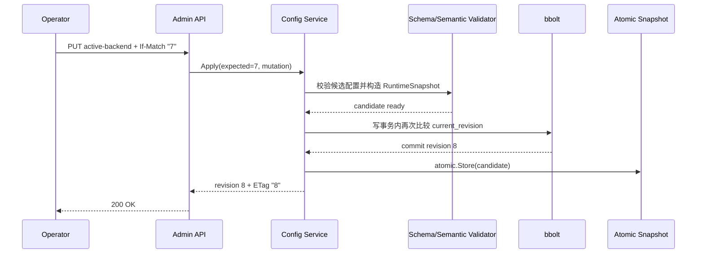
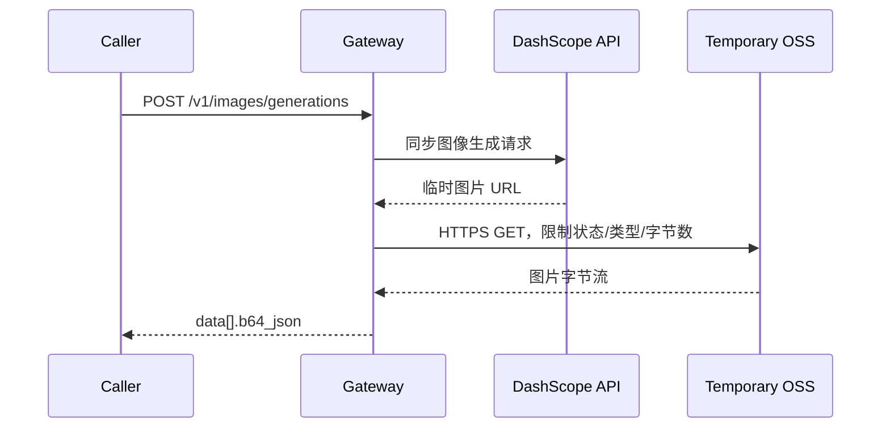

# AI 网关详细设计 01

- 文档版本：1.0
- 状态：已归档，待用户评审
- 创建日期：2026-07-15
- 归档日期：2026-07-15
- 最后验证日期：2026-07-15
- 输入来源：[Input 01](../chat/input_01.md)、[Input 02](../chat/input_02.md)、[Input 03](../chat/input_03.md)
- 归档依据：[Input 04](../chat/input_04.md)

## 1. 前置说明

### 1.1 本次交付范围

本文件给出一个可直接实施的 Go AI 网关设计。网关接入 OpenAI 和 DashScope，公开 Chat Completions 与 Images Generations 两类能力；配置由 Schema 驱动，并可通过管理 API 原子切换 Backend。图片响应只向调用方返回 Base64，不返回 Provider 临时 URL。

当前工作区为空且不是 Git 仓库，本轮只创建设计文档和需求原文归档，不创建 Go 代码。因此本轮没有可执行的构建、测试或覆盖率结果；第 17 节定义了实现完成后的强制验证门槛。第一阶段设计现已冻结归档，用户评审完成前不进入实现阶段。

### 1.2 假设与边界

- 项目形态为独立 Go 服务，不以 Higress、Envoy 或 Kubernetes 为运行时前提。
- 首版部署单元为单实例写控制面；数据面与控制面运行在同一进程、不同监听地址。多实例一致性不在本版范围内。
- 数据面部署在受控内网。按会话约束，本版不增加用户认证、RBAC、mTLS、WAF、内容审核或租户计费。
- Provider API Key 已由运行环境注入。配置只保存环境变量名，不保存密钥值。
- DashScope Image 首版只接入当前同步图像生成端点；旧模型的异步任务协议不纳入统一同步接口。
- `model` 是稳定的网关模型别名，不直接等同于 Provider 模型名。

### 1.3 数据时效与不确定性

所有外部事实均在 2026-07-15 访问并核验。Provider 模型名、区域端点、SDK 类型和字段可能在后续版本变化，实施时必须使用本文锁定的依赖版本，并以仓库内契约测试阻止无审查升级。配置示例中的模型用于演示路由关系，不构成长期模型推荐。

### 1.4 工具降级与回滚说明

- OpenAI 官方文档 MCP 已写入本机配置，但当前会话未热加载该工具；本次只读调研降级为 OpenAI 官方开发者站点和官方 GitHub 仓库。影响仅限资料获取方式，不影响文件内容。后续会话重启后可改用官方文档 MCP 复核。
- 当前会话没有专用 Markdown 文件编辑 MCP，因此使用 `apply_patch` 写入四个 Markdown 文件，并用安全 Shell 创建 `docs/design`、`docs/chat` 目录。影响范围仅为本文件及三份输入归档。
- 回滚时删除本次新增的 `docs/design/design_01.md`、`docs/chat/input_01.md`、`docs/chat/input_02.md`、`docs/chat/input_03.md`；当前目录不是 Git 仓库，不能依赖 Git 回滚。

## 2. 目标、非目标与成功标准

### 2.1 功能目标

1. 对外提供 OpenAI 兼容子集：
   - `POST /v1/chat/completions`，支持同步与 SSE 流式响应。
   - `POST /v1/images/generations`，支持同步图片生成。
   - `GET /v1/models`，返回网关模型别名。
2. 接入两个 Provider：
   - OpenAI Chat 和 Image 都使用官方 Go SDK。
   - DashScope Chat 和 Image 都使用自建 `net/http` 适配器。
3. 以 YAML 编写的 OpenAPI 3.1.0 文件作为数据面、管理面和 `GatewayConfig` 的单一事实源。
4. 管理 API 支持 Backend 增删改、Route 的活跃 Backend 切换、配置版本查询与回滚。
5. 配置更新具备单调 Revision、乐观锁、持久化和原子可见性。
6. 图片结果统一输出 `data[].b64_json`，无论上游返回 Base64 还是临时 URL。

### 2.2 非目标

- Responses API、Embeddings、Rerank、Audio、Image Edit 和图片流式生成。
- DashScope 旧图像模型的异步任务创建与轮询。
- 加权负载均衡、跨区域自动调度和多实例控制面一致性。
- 用户认证、租户配额、内容审核、成本结算和密钥管理系统。
- Prometheus、OpenTelemetry 或远端 CI/CD。
- 将 Provider 的全部私有参数透传给调用方。

### 2.3 SLO 与 SLI

| 指标 | 目标 | 口径 |
| --- | --- | --- |
| 网关可用性 | 月度不低于 99.9% | 排除已确认的 Provider 故障；以网关自身 5xx 和不可达计数 |
| Chat 路由额外时延 | p99 不高于 20 ms | 总时延减去已记录的上游时延，不含响应体网络传输 |
| Chat 流式首块额外时延 | p99 不高于 20 ms | 网关收到上游首块到调用方写出首块的差值 |
| 配置切换生效时延 | p99 不高于 100 ms | 管理请求进入到新 Revision 对新请求可见，包含本地持久化 |
| 配置原子性 | 100% | 任一请求只能观察完整的旧 Revision 或完整的新 Revision |
| 图片输出一致性 | 100% | 成功响应的每个 `data` 元素只有非空 `b64_json`，没有 `url` |
| 代码覆盖率 | 不低于 90% | `go test -coverprofile` 的项目总覆盖率 |

Provider 总时延不纳入网关自身 SLO，但必须单独记录，以便区分网关和上游问题。

### 2.4 可量化验收

- OpenAI 和 DashScope 各自通过 Chat 同步、Chat SSE、Image 同步三组契约测试。
- 在 1,000 个并发读取请求和连续 100 次 Backend 切换下，`go test -race` 无数据竞争，请求不出现混合 Revision。
- 管理 API 的并发写入只有一个请求以给定 Revision 成功，其余返回 `409 revision_conflict`。
- DashScope 临时 URL 在网关响应前完成下载；断开 Provider 资源访问后，调用方仍能解码成功响应中的 Base64。
- 所有失败路径均返回第 11 节定义的稳定错误结构，不泄露 Provider API Key、提示词或 Base64 内容。

## 3. 参考项目与技术决策

### 3.1 可复用的设计思想

Higress 的 AI Proxy 采用 OpenAI 风格协议、模型映射和 Provider 协议转换；其 AI Statistics 记录 Token、首 Token 时延和总时延，模型路由还覆盖主备切换。本文复用“统一公开协议、稳定模型名、Provider 适配、AI 专用观测字段”的思想，但不复用 Higress 插件运行时。

Envoy AI Gateway 将 `AIGatewayRoute` 与 `AIServiceBackend` 分离，由控制面把声明式资源翻译到数据面；其稳定模型别名可映射到不同 Provider 模型，并已覆盖 Chat Completions 与 Image Generations。本文复用“Route 与 Backend 分离、Schema 资源、不可变运行时快照”的思想，但不引入 Envoy、xDS 或 Kubernetes CRD。

### 3.2 方案对比

评分范围为 1～5，权重之和为 100%。总分为加权平均。

| 方案 | 协议契合 20% | 官方 Go SDK 约束 25% | 动态 API 20% | Base64 归一化 20% | 运维成本 15% | 总分 |
| --- | ---: | ---: | ---: | ---: | ---: | ---: |
| 扩展 Higress | 4 | 1 | 4 | 3 | 2 | 2.75 |
| 扩展 Envoy AI Gateway | 5 | 1 | 5 | 4 | 2 | 3.35 |
| 独立 Go 网关 | 5 | 5 | 5 | 5 | 4 | 4.85 |

选择独立 Go 网关。决定性原因是用户明确要求 OpenAI Chat 使用官方 Go SDK、OpenAI Image 在 SDK 存在时也使用 SDK，并要求 DashScope 自建适配器；在现有代理上扩展会绕过或重复其 Provider 运行时。

### 3.3 核心 ADR

#### ADR-01：采用 YAML 编写的 OpenAPI 3.1.0 单一事实源

日期：2026-07-15｜状态：通过

背景：接口、配置文件和管理 API 若分别维护结构，会产生字段漂移。

备选方案：

- 独立 JSON Schema 加手写 HTTP 类型：配置表达力强，但接口与配置存在两个事实源。
- Protobuf：适合 RPC，但不能直接提供 OpenAI 兼容 JSON 契约。
- OpenAPI 3.1.0：Schema 与 JSON Schema 2020-12 语义对齐，可同时生成 Go 类型和 HTTP 边界。

决策：`api/openapi/gateway.yaml` 是唯一 Schema 源文件，全部使用 YAML 编写，不维护平行的 JSON Schema 文件；`GatewayConfig` 位于 `components/schemas`。启动配置也使用 YAML。使用 `oapi-codegen v2.7.2` 生成模型和 `std-http-server` 代码；运行时另做跨资源语义校验。

后果：Schema 变更先改 OpenAPI，再重新生成并审查代码。生成器只读取仓库内受控文件，不在构建时下载远端 Spec。v2.7.2 发布说明指出生成器曾修复代码注入问题，因此必须校验 Spec、审查生成差异并扫描生成代码中的异常 `init()`。

#### ADR-02：采用 Revision CAS 和不可变快照

日期：2026-07-15｜状态：通过

决策：管理写请求必须携带 `If-Match`。候选配置完整校验和持久化后，通过 `atomic.Pointer[RuntimeSnapshot]` 一次性交换。请求在入口读取一次快照并持有到结束。

后果：在途请求不会被中途切换。旧快照由仍持有它的请求自然保活；Provider 客户端复用进程级 `http.Transport`，快照淘汰不关闭在途连接。

#### ADR-03：采用 bbolt 保存配置 Revision

日期：2026-07-15｜状态：通过

决策：首版用 `go.etcd.io/bbolt v1.4.3` 保存单调 Revision、规范化配置 JSON、配置摘要和审计元数据。

后果：得到单文件 ACID 事务和低运维成本，但只允许一个进程持有写锁。多实例控制面必须在后续设计中把 `ConfigStore` 替换为外部一致性存储，不能共享同一个 bbolt 文件。

## 4. 总体架构



### 4.1 分层职责

| 层 | 职责 | 禁止事项 |
| --- | --- | --- |
| Transport | HTTP 解码、OpenAPI 边界、SSE 写出、错误序列化 | 不选择 Provider，不读取密钥 |
| Application | Chat/Image 用例、路由、Fallback、配置应用流程 | 不依赖具体 SDK 类型 |
| Domain | 规范化请求响应、小接口、错误类别、配置语义 | 不依赖 HTTP 和持久化实现 |
| Provider Adapter | Provider 请求转换、SDK/HTTP 调用、响应归一化 | 不修改全局配置 |
| Config Adapter | bbolt 事务、Revision、恢复、审计元数据 | 不构造 Provider 请求 |
| Observe | `slog`、`expvar`、健康状态 | 不记录内容正文和密钥 |

### 4.2 关键 Go 接口

接口定义在消费者所在包，保持最小化。下面是约束性接口草案，具体请求类型由领域层定义，不直接暴露 SDK 类型。

```go
type ChatCompleter interface {
    Complete(ctx context.Context, req ChatRequest) (ChatResponse, error)
}

type ChatStreamer interface {
    Stream(ctx context.Context, req ChatRequest) (ChatStream, error)
}

type ChatStream interface {
    Next() bool
    Chunk() ChatChunk
    Err() error
    Close() error
}

type ImageGenerator interface {
    Generate(ctx context.Context, req ImageRequest) (ImageResponse, error)
}

type ConfigStore interface {
    Current(ctx context.Context) (ConfigRevision, error)
    CompareAndSwap(
        ctx context.Context,
        expected uint64,
        candidate GatewayConfig,
        audit AuditMetadata,
    ) (ConfigRevision, error)
    Get(ctx context.Context, revision uint64) (ConfigRevision, error)
    List(ctx context.Context, before uint64, limit int) ([]RevisionSummary, error)
}
```

构造函数显式接收依赖，`cmd/gateway/main.go` 负责手工装配。首版不引入依赖注入框架。

## 5. Schema 驱动设计

### 5.1 YAML 单一事实源

`api/openapi/gateway.yaml` 是使用 YAML 编写的 OpenAPI 3.1.0 文档，同时定义：

- 数据面 Paths 和请求响应。
- 管理面 Paths 和请求响应。
- `GatewayConfig`、`Backend`、`Route`、`Limits` 等配置 Schema。
- 错误结构、枚举、长度、范围、格式和 `additionalProperties: false`。

生成产物为：

- `internal/api/gen/models.gen.go`：HTTP 与配置模型。
- `internal/api/gen/server.gen.go`：基于 Go 标准库 `net/http` 的服务接口和路由。
- `internal/api/gen/spec.gen.go`：嵌入后的 OpenAPI 文档。

不再维护 `.json` Schema 文件。YAML 只改变源文件和本地配置的可读格式，不改变管理 API 的 JSON Wire Format；管理 API 与本地 YAML 最终映射到同一个 `GatewayConfig` 生成类型。

生成产物提交到仓库。`go generate ./...` 必须可重复执行；生成后出现未预期差异即验证失败。`oapi-codegen` 的 strict wrapper 提供类型化边界，但不能替代完整请求校验，因此数据面、管理面和启动配置都必须执行嵌入 Spec 校验。

本地配置解析采用 `go.yaml.in/yaml/v3 v3.0.4`，流程固定为：

1. 以配置文件大小上限读取单个 YAML 文档，拒绝第二个文档。
2. 解析为 `yaml.Node`，拒绝重复 Key、非字符串 Key、自定义 Tag、Anchor、Alias 和 Merge Key。
3. 归一化为只包含 JSON 数据模型的值，再用标准库 `encoding/json` 编码。
4. 使用嵌入的 `GatewayConfig` Schema 校验归一化结果。
5. 反序列化为生成的 Go 类型，并继续执行第 5.4 节语义校验。

这样既保留 YAML 的易读、易写优势，也避免 YAML 特有语义绕过 Schema。

### 5.2 配置文档示例

以下 YAML 是可通过 Schema 校验的结构示例。`example-workspace` 是阿里云工作空间域名示例，部署时必须替换为实际工作空间端点。

```yaml
api_version: gateway.ai/v1
kind: GatewayConfig
metadata:
  name: default
spec:
  backends:
    - id: openai-primary
      provider: openai
      capabilities:
        - chat
        - image
      credential:
        api_key_env: OPENAI_API_KEY
      timeouts:
        chat_seconds: 120
        stream_idle_seconds: 60
        image_seconds: 300
      openai:
        base_url: https://api.openai.com/v1

    - id: dashscope-cn
      provider: dashscope
      capabilities:
        - chat
        - image
      credential:
        api_key_env: DASHSCOPE_API_KEY
      timeouts:
        chat_seconds: 120
        stream_idle_seconds: 60
        image_seconds: 300
      dashscope:
        region: cn-beijing
        chat_base_url: https://dashscope.aliyuncs.com/compatible-mode/v1
        image_generation_url: >-
          https://example-workspace.cn-beijing.maas.aliyuncs.com/api/v1/services/aigc/multimodal-generation/generation

  routes:
    - id: chat-default
      operation: chat
      model_alias: chat-default
      active_backend: openai-primary
      targets:
        - backend_id: openai-primary
          upstream_model: gpt-5.2
        - backend_id: dashscope-cn
          upstream_model: qwen3.7-plus
      fallback:
        enabled: true
        max_attempts: 2

    - id: image-default
      operation: image
      model_alias: image-default
      active_backend: openai-primary
      targets:
        - backend_id: openai-primary
          upstream_model: gpt-image-2
        - backend_id: dashscope-cn
          upstream_model: qwen-image-2.0-pro
      fallback:
        enabled: false
        max_attempts: 1

  limits:
    chat_request_bytes: 4194304
    image_request_bytes: 1048576
    image_raw_bytes_per_response: 33554432
    chat_concurrency: 256
    image_concurrency: 4
    images_per_request: 4
```

### 5.3 结构校验规则

- 所有对象默认 `additionalProperties: false`。
- `api_version` 固定为 `gateway.ai/v1`，`kind` 固定为 `GatewayConfig`。
- ID 匹配 `^[a-z][a-z0-9-]{0,62}$`。
- `provider` 为 `openai` 时必须且只能出现 `openai` 配置；`dashscope` 同理。
- `capabilities` 至少一项且不得重复。
- URL 必须为绝对 HTTPS URL。
- 超时、并发数和字节数必须位于 Schema 定义的正整数范围。
- `fallback.max_attempts` 范围为 1～2；Image Route 固定为 1。
- `images_per_request` 范围为 1～4。
- YAML 文件只能包含一个文档，且禁止 Anchor、Alias、Merge Key、自定义 Tag 和非字符串 Key。

### 5.4 语义校验规则

下列规则涉及集合引用，不能只依赖 JSON Schema：

1. Backend ID、Route ID 和 `model_alias` 各自唯一。
2. Route 的每个 `backend_id` 必须存在，且同一 Route 内不得重复。
3. `active_backend` 必须属于当前 Route 的 `targets`。
4. Backend 的 `capabilities` 必须包含 Route 的 `operation`。
5. `upstream_model` 不得为空；网关不臆测默认模型。
6. Image Route 禁止自动 Fallback。
7. DashScope API Key、Chat Base URL 和 Image Endpoint 必须属于同一区域配置。
8. 激活前必须能从环境中读取每个被引用 Backend 的 `api_key_env`。
9. 至少存在一条 Chat Route 和一条 Image Route，且每条 Route 至少有一个 Target。

### 5.5 启动配置

`--bootstrap-config /etc/ai-gateway/gateway.yaml` 只在 bbolt 尚无 Revision 时导入，并生成 Revision 1。仓库中的 `configs/gateway.example.yaml` 用作可读模板，不会被自动加载。数据库已有 Revision 时忽略 Bootstrap 文件，避免重启覆盖动态配置。启动失败条件包括 YAML 解析失败、Schema 不合法、语义不合法、密钥环境变量缺失、数据库不可写或运行时客户端构造失败。

## 6. 动态 Backend API

### 6.1 管理接口

管理面默认只监听 `127.0.0.1:9090`。

| 方法与路径 | 用途 | 乐观锁 |
| --- | --- | --- |
| `GET /admin/v1/config` | 读取当前配置和 Revision | 无 |
| `PUT /admin/v1/config` | 全量替换配置 | 必须 `If-Match` |
| `GET /admin/v1/backends` | 列出当前 Backend | 无 |
| `PUT /admin/v1/backends/{backend_id}` | 新增或替换一个 Backend | 必须 `If-Match` |
| `DELETE /admin/v1/backends/{backend_id}` | 删除未被 Route 引用的 Backend | 必须 `If-Match` |
| `PUT /admin/v1/routes/{route_id}/active-backend` | 切换 Route 的活跃 Backend | 必须 `If-Match` |
| `GET /admin/v1/revisions` | 分页列出 Revision 摘要 | 无 |
| `GET /admin/v1/revisions/{revision}` | 读取历史配置 | 无 |
| `POST /admin/v1/revisions/{revision}/restore` | 从历史配置创建新 Revision | 必须 `If-Match` |

所有成功写操作返回新 `revision`、`ETag`、配置 SHA-256 摘要和变更摘要。回滚不会把当前 Revision 数字倒退，而是复制目标历史配置并创建新的单调 Revision。

### 6.2 切换示例

请求：

```http
PUT /admin/v1/routes/chat-default/active-backend HTTP/1.1
Host: 127.0.0.1:9090
If-Match: "7"
Content-Type: application/json

{"backend_id":"dashscope-cn"}
```

响应：

```http
HTTP/1.1 200 OK
ETag: "8"
Content-Type: application/json

{
  "revision": 8,
  "route_id": "chat-default",
  "active_backend": "dashscope-cn",
  "config_sha256": "7e2f3f294fc0c0f28e90f05dbbdf135f5f4fa35c82a33f684f3f86e6b23c39b7"
}
```

摘要值由规范化配置计算，示例值只说明响应格式，不能作为实际配置摘要。

### 6.3 原子应用流程



完整步骤如下：

1. OpenAPI 校验请求体和 `If-Match`。
2. 读取当前快照，比较期望 Revision；不一致立即返回 409。
3. 深复制配置并应用单一变更。
4. 执行结构校验、语义校验和环境密钥解析。
5. 构造全部被引用的 Provider Runtime；不发起会产生费用的模型探测请求。
6. 在 bbolt 单个写事务中再次比较当前 Revision，写入新配置、摘要和审计元数据，并更新 `current_revision`。
7. 事务提交后执行一次 `atomic.Store`。
8. 返回新 Revision。若进程在步骤 6 后、步骤 7 前退出，重启时会从已提交 Revision 重建快照。

任何校验、构造或持久化失败都不修改当前快照。在途请求持有入口处取得的旧快照；新请求只会取得新快照。

### 6.4 并发控制

- 管理写操作经单进程互斥锁串行化，bbolt 事务内仍进行最终 CAS，避免逻辑遗漏。
- 数据面只执行 `atomic.Load`，不获取管理锁。
- Revision 使用无符号 64 位单调整数。
- 删除仍被 Route 引用的 Backend 返回 `409 backend_in_use`。
- 相同 `If-Match` 的并发请求最多一个成功。

## 7. 数据面接口契约

### 7.1 Chat Completions

`POST /v1/chat/completions` 接受 OpenAI 兼容子集：

- 必填：`model`、`messages`。
- 通用可选：`temperature`、`top_p`、`max_completion_tokens`、`stop`、`stream`、`stream_options`、`tools`、`tool_choice`、`response_format`、`user`。
- 未在 OpenAPI Schema 声明的字段返回 `400 unsupported_parameter`，不静默透传。
- `model` 必须是 operation 为 `chat` 的 `model_alias`。
- 同步响应和 SSE Chunk 的 `model` 都改写回调用方提交的别名。
- SSE 采用 `text/event-stream`，每块为 `data: {json}`，结尾为 `data: [DONE]`。
- 调用方取消请求时，`context.Context` 取消必须传播到 SDK 或 DashScope HTTP 请求。

### 7.2 Images Generations

`POST /v1/images/generations` 接受以下公共字段：

- 必填：`model`、`prompt`。
- 可选：`n`、`size`、`quality`、`style`、`output_format`、`response_format`、`user`。
- `response_format` 只能省略或为 `b64_json`；传 `url` 返回 `400 unsupported_parameter`。
- `n` 范围为 1～配置中的 `images_per_request`，且所有原始图片总字节数不得超过 `image_raw_bytes_per_response`。
- 成功响应固定为 OpenAI 风格：

```json
{
  "created": 1784102400,
  "data": [
    {
      "b64_json": "iVBORw0KGgoAAA..."
    }
  ]
}
```

响应不得包含 `url`。`created` 为网关完成归一化时的 Unix 秒时间戳。

### 7.3 Models

`GET /v1/models` 只返回配置中的稳定别名和能力，不调用 Provider：

```json
{
  "object": "list",
  "data": [
    {
      "id": "chat-default",
      "object": "model",
      "owned_by": "ai-gateway",
      "capability": "chat"
    },
    {
      "id": "image-default",
      "object": "model",
      "owned_by": "ai-gateway",
      "capability": "image"
    }
  ]
}
```

### 7.4 公共响应头

- `x-request-id`：请求唯一标识。
- `x-ai-gateway-revision`：本请求绑定的配置 Revision。
- `x-ai-gateway-backend`：实际使用的 Backend ID。

调用方可记录这些头进行问题定位，但不得用它们替代稳定模型别名。

## 8. Provider 适配

### 8.1 能力矩阵

| Provider | Chat 同步 | Chat SSE | Image 同步 | 上游图片形态 | 网关实现 |
| --- | --- | --- | --- | --- | --- |
| OpenAI | 是 | 是 | 是 | GPT Image 默认 Base64；旧模型可返回 URL | 官方 `openai-go/v3` |
| DashScope | 是 | 是 | 是，限当前同步模型 | 临时 OSS URL | 自建 `net/http` |

### 8.2 OpenAI Adapter

依赖锁定为 `github.com/openai/openai-go/v3 v3.43.0`。官方 SDK 已提供：

- `client.Chat.Completions.New`：同步 Chat。
- `client.Chat.Completions.NewStreaming`：流式 Chat。
- `client.Images.Generate`：同步图片生成。

实现要求：

1. 每个 Backend 构造不可变 SDK Client，显式配置 API Key、Base URL、共享 `http.Client` 和超时。
2. SDK 默认会对连接错误、408、409、429 和 5xx 自动重试两次。网关必须设置 `option.WithMaxRetries(0)`，由第 9 节统一决定重试和 Fallback，避免重试叠加。
3. Chat 请求只映射公共 Schema 字段；上游模型使用 Route Target 的 `upstream_model`。
4. Image 请求优先要求 `b64_json`。GPT Image 的 SDK 响应直接读取 `B64JSON`；若兼容旧模型只返回 URL，则进入与 DashScope 相同的受限下载归一化器。
5. SDK 错误先转换成领域错误类别，再由 HTTP 层映射，禁止直接把 SDK 错误文本返回调用方。

### 8.3 DashScope Chat Adapter

Chat 调用 `POST {chat_base_url}/chat/completions`。中国内地示例 Base URL 为 `https://dashscope.aliyuncs.com/compatible-mode/v1`。

实现要求：

- 使用标准库 `net/http`、显式结构体和 `json.Decoder`，不使用 `map[string]any` 拼接核心协议。
- Header 使用 `Authorization: Bearer {api_key}` 和 `Content-Type: application/json`。
- 同步响应解析为规范化 `ChatResponse`。
- `stream=true` 时逐行解析 SSE；只接受 `data:` 事件，识别 `[DONE]`，对畸形 JSON 返回流错误。
- 复用进程级 `http.Transport`，禁止每次请求新建 Transport。
- API Key 与 Base URL 必须属于同一区域；配置校验不自动跨区域改写。

### 8.4 DashScope Image Adapter

当前 Qwen Image 同步接口为 `POST {image_generation_url}`。请求由适配器转换为 DashScope 的 `input.messages[].content[].text` 和 `parameters` 结构。

DashScope 返回的是短期有效 OSS URL，官方文档说明通常有效 24 小时。网关必须在 Provider 响应后立即下载，不能把 URL 返回给调用方或持久化为业务结果。



下载与编码规则：

1. 只接受 HTTPS URL，最多跟随 3 次 HTTPS 重定向。
2. 必须收到 2xx；`Content-Type` 必须是 `image/png`、`image/jpeg` 或 `image/webp`。
3. 用 `io.LimitReader` 对每张图片和响应总量做硬限制；超限立即终止。
4. 原始图片不写日志、不进入 bbolt。
5. 单响应原始数据不超过 32 MiB。8 MiB 以内使用内存 Spool；更大内容写入 `data/tmp` 的请求级临时文件，并在请求结束删除。
6. 所有图片完整下载并校验后再写 HTTP 200；使用 `base64.NewEncoder` 将 Spool 流式写入 JSON，避免同时持有原始字节和完整编码副本。
7. 客户端在响应写出中断开时停止编码，记录 `client_disconnect`，不重试图片生成。

## 9. 路由、重试与错误路径

### 9.1 路由算法

1. 根据 Path 得到 operation。
2. 从请求入口绑定的 RuntimeSnapshot 中按 `model_alias + operation` 查找 Route。
3. 首次尝试使用 `active_backend`。
4. 将 Target 的 `upstream_model` 写入 Provider 请求。
5. 若符合 Fallback 条件，按 `targets` 中除 active 以外的声明顺序选择下一项。
6. 响应中的模型名改写为别名，记录实际 Backend 与 Revision。

首版没有权重和随机负载均衡，路由结果可重复、可审计。

### 9.2 Chat 重试与 Fallback

- 总尝试次数最多为 2，包含首次请求。
- 仅对连接错误、408、429 和 5xx 启用 Fallback。
- 请求校验错误、Provider 400、Provider 401/403 和调用方取消不重试。
- SSE 在向调用方写出第一块之前允许 Fallback；写出第一块后禁止切换，只能结束当前流。
- 单次尝试使用 Backend Chat Timeout；流式连接另使用 Stream Idle Timeout，每收到一块重置空闲计时。

### 9.3 Image 重试

Image Route 的 `max_attempts` 固定为 1。任何自动重试都可能产生重复计费或重复图片，因此网络错误、超时、URL 下载失败和 Base64 编码失败均直接返回错误。运维可切换 Backend 后由调用方显式重试。

### 9.4 超时传播

- 数据面 Handler 从请求 Context 派生 Backend Timeout。
- 调用方断开、服务优雅退出或 Deadline 到期都会取消上游调用。
- 禁止在 Adapter 内用 `context.Background()` 脱离请求生命周期。
- 配置更新和 bbolt 操作使用管理请求 Context，但事务一旦开始提交，不在半提交状态中止。

## 10. 持久化与一致性

### 10.1 bbolt 布局

| Bucket/Key | 内容 |
| --- | --- |
| `meta/store_version` | 存储 Schema 版本，首版为 1 |
| `meta/current_revision` | 当前 Revision |
| `revisions/{20位十进制revision}` | 规范化 `GatewayConfig` JSON |
| `revision_meta/{20位十进制revision}` | 创建时间、摘要、操作类型、请求 ID |

Revision Key 固定宽度，保证字典序与数值顺序一致。密钥值、提示词、模型响应和 Base64 图片不进入数据库。

### 10.2 恢复

- 正常启动读取 `current_revision`，重新执行 Schema、语义和密钥解析，再构造 RuntimeSnapshot。
- 最新 Revision 无法构造时，服务启动失败，不静默回退旧配置，避免实际状态与持久化状态不一致。
- 管理回滚通过历史 Revision 创建新 Revision，保留完整审计链。
- 发布前用 bbolt 只读事务生成一致性备份；恢复前停止进程并保留原数据库副本。

### 10.3 配置迁移

当前不存在旧数据，无迁移，直接创建 `store_version=1`。未来存储格式变化必须在独立设计版本中提供单事务迁移、备份和失败回滚，禁止启动时部分迁移。

## 11. 错误契约

公开错误统一为：

```json
{
  "error": {
    "message": "model alias is not configured",
    "type": "invalid_request_error",
    "param": "model",
    "code": "model_not_found",
    "request_id": "req_01J2R8M3YQ96H5YVNC2W5T7G8A"
  }
}
```

| HTTP | Code | 场景 |
| ---: | --- | --- |
| 400 | `invalid_request` | Schema 或参数语义错误 |
| 400 | `unsupported_parameter` | 请求 URL 图片、未知字段或不支持的 Provider 私有参数 |
| 404 | `model_not_found` | 模型别名不存在或能力不匹配 |
| 409 | `revision_conflict` | `If-Match` 与当前 Revision 不一致 |
| 409 | `backend_in_use` | 删除仍被 Route 引用的 Backend |
| 413 | `request_too_large` | 请求体超过限制 |
| 422 | `invalid_config` | 配置结构或跨资源语义错误 |
| 422 | `credential_unavailable` | 配置引用的环境密钥不存在 |
| 429 | `gateway_capacity_exceeded` | 本地并发容量耗尽 |
| 499 | `client_cancelled` | 仅记内部状态；已能写响应时不强制发送非标准状态 |
| 502 | `upstream_error` | Provider 错误或格式不合法 |
| 502 | `upstream_authentication_error` | Provider Key 被拒绝，不向调用方伪装为调用方 401 |
| 502 | `upstream_payload_too_large` | Provider 图片超过上限 |
| 503 | `backend_unavailable` | Route 没有可用 Backend |
| 504 | `upstream_timeout` | Provider 或临时 URL 下载超时 |

对外 `message` 使用网关稳定文案。Provider 原始错误只写受控日志字段 `upstream_code` 和 `upstream_status`，不直接回显响应体。

## 12. 并发、容量与内存

### 12.1 默认限制

| 项目 | 默认值 | 行为 |
| --- | ---: | --- |
| Chat 请求体 | 4 MiB | 超限返回 413 |
| Image 请求体 | 1 MiB | 超限返回 413 |
| Chat 并发 | 256 | 无槽位返回 429 |
| Image 并发 | 4 | 无槽位返回 429 |
| 单次图片数量 | 4 | 超限返回 400 |
| 单次图片原始总量 | 32 MiB | 上游超限返回 502 |
| Chat Timeout | 120 s | 返回 504 |
| Stream Idle Timeout | 60 s | 结束 SSE |
| Image Timeout | 300 s | 返回 504 |
| 临时 URL 下载 Timeout | 60 s | 返回 504 |

并发限制用有界信号量实现。获取槽位不创建额外 Goroutine；请求 Context 取消时立即退出等待。

### 12.2 内存预算

Base64 体积约为原始数据的 4/3。DashScope 使用受限 Spool 和流式编码，避免 32 MiB 原始数据与约 42.7 MiB Base64 同时驻留堆。OpenAI SDK 的 GPT Image 响应本身包含 Base64 字符串，最坏情况下 4 个并发 Image 请求约占 171 MiB Base64 Payload，再加 JSON 和 SDK 开销；容量测试以进程 RSS 不超过 512 MiB 为默认验收上限。

### 12.3 性能基准

```yaml
target: ai-gateway
workload:
  chat_rps: [100, 500, 1000]
  image_concurrency: [1, 2, 4]
  duration: 5m
metrics:
  - gateway_overhead_p50_ms
  - gateway_overhead_p95_ms
  - gateway_overhead_p99_ms
  - stream_forward_delay_p99_ms
  - config_switch_p99_ms
  - throughput_rps
  - rss_mb
pass_thresholds:
  gateway_overhead_p99_ms: 20
  stream_forward_delay_p99_ms: 20
  config_switch_p99_ms: 100
  rss_mb: 512
```

基准 Provider 使用本地 `httptest.Server` 注入固定延迟，不把公网抖动混入网关基准。

## 13. 可观测性

遵循项目约束，不引入 Prometheus 或 OpenTelemetry。

### 13.1 结构化日志

使用标准库 `log/slog` 输出 JSON。每个完成事件包含：

- `request_id`、`operation`、`model_alias`、`backend_id`、`provider`、`config_revision`。
- `status`、`upstream_status`、`error_code`、`fallback_count`。
- `duration_ms`、`upstream_duration_ms`、`gateway_overhead_ms`。
- Chat：`time_to_first_chunk_ms`、`input_tokens`、`output_tokens`。
- Image：`image_count`、`raw_image_bytes`、`base64_bytes`、`download_duration_ms`。

禁止记录 Authorization、API Key、完整请求体、提示词、消息正文、临时 URL 查询串和 Base64。

### 13.2 本地指标

管理监听地址暴露标准库 `expvar`：

- 请求数、错误数、Fallback 数。
- 当前 Revision 和上次配置更新时间。
- Chat/Image 当前并发与拒绝数。
- Provider 状态码计数、Token 总数、图片字节总数。

`/healthz` 只表示进程存活；`/readyz` 要求 bbolt 可读、当前快照存在且每条 Route 有活跃 Runtime。就绪检查不调用收费 Provider API。

## 14. 必要的运行边界

本节只保留完成网关功能所必需的边界，不扩展安全基线：

- 数据面和管理面分离监听；管理面默认只绑定 Loopback。
- Provider API Key 只从环境变量读取，不进入 Schema Payload、bbolt 或日志。
- 调用方 `Authorization` 不转发给 Provider；上游认证始终使用 Backend 自己的 Key。
- Provider 图片 URL 只用于当前请求的受限 HTTPS 下载，不作为公共返回值。
- 本版不实现用户鉴权、RBAC、mTLS、内容审核、WAF 或安全审计平台；部署方必须把数据面置于受控网络。

## 15. 项目布局

```text
.
├── api
│   └── openapi
│       ├── gateway.yaml
│       └── oapi-codegen.yaml
├── cmd
│   └── gateway
│       └── main.go
├── configs
│   └── gateway.example.yaml
├── docs
│   ├── chat
│   │   ├── input_01.md
│   │   ├── input_02.md
│   │   ├── input_03.md
│   │   └── input_04.md
│   └── design
│       └── design_01.md
├── internal
│   ├── api
│   │   ├── admin
│   │   ├── data
│   │   └── gen
│   ├── application
│   ├── config
│   ├── domain
│   ├── observe
│   ├── provider
│   │   ├── dashscope
│   │   └── openai
│   └── store
│       └── bbolt
├── go.mod
├── go.sum
└── mise.toml
```

原则：

- 业务包全部放在 `internal`，不创建无明确外部消费者的 `pkg`。
- Provider 包只实现领域接口，不互相依赖。
- 生成代码独立放在 `internal/api/gen`，禁止手工编辑。
- Go 版本使用本机已验证的 `go1.26.5`，通过 `mise.toml` 固定；OpenAI SDK 要求的 Go 版本低于该基线。

## 16. 依赖基线

| 依赖 | 固定版本 | 用途 | 选用依据 |
| --- | --- | --- | --- |
| Go | 1.26.5 | 语言与标准库 | 本机已安装并验证 |
| `github.com/openai/openai-go/v3` | 3.43.0 | OpenAI Chat/Image | 官方 SDK，2026-07-14 发布 |
| `github.com/oapi-codegen/oapi-codegen/v2` | 2.7.2 | OpenAPI 3.1 Go 代码生成 | 官方项目，2026-07-07 最新发布 |
| `go.yaml.in/yaml/v3` | 3.0.4 | 严格解析本地 YAML 配置 | YAML 官方组织维护的稳定 v3 |
| `go.etcd.io/bbolt` | 1.4.3 | 单实例配置 Revision 存储 | etcd 官方维护的嵌入式 KV |
| `go.uber.org/goleak` | 1.3.0 | 测试 Goroutine 泄漏 | 仅测试依赖 |

依赖通过 `go.mod` 和 `go.sum` 锁定。代码生成器使用 Go `tool` 指令固定版本，不执行 `@latest`。升级前执行契约测试、`govulncheck ./...` 和生成差异审查；实施时新增依赖前需再次确认授权。

## 17. 测试与质量门槛

### 17.1 测试矩阵

| 层级 | 重点用例 | 工具 |
| --- | --- | --- |
| Schema/YAML | 合法/非法配置、oneOf、未知字段、范围、重复 Key、多文档、Anchor/Alias/Tag | YAML Parser、OpenAPI Validator、表驱动测试 |
| 语义 | 重复 ID、悬空引用、能力不匹配、无效 active Backend | Go 单元测试 |
| Store | CAS 冲突、事务失败、Revision 排序、恢复与备份 | 临时 bbolt 文件 |
| OpenAI 契约 | SDK 请求字段、同步 Chat、SSE、Image Base64、错误映射 | `httptest.Server` |
| DashScope 契约 | 兼容 Chat、畸形 SSE、同步 Image、URL 过期/超限/类型错误 | `httptest.Server` |
| 路由 | Alias、动态切换、Fallback 顺序、首块后禁止切换 | 表驱动与并发测试 |
| E2E | 启动网关、配置切换、两 Provider 假服务、Base64 解码 | 本地进程测试 |
| 并发 | 1,000 Readers + 100 Switches、取消、优雅退出 | `go test -race`、goleak |
| 模糊 | SSE 行、Provider JSON、错误体、配置解码 | Go Fuzz |
| 性能 | 路由开销、Base64、配置切换、内存峰值 | Go Benchmark、本地压测 |

### 17.2 本地验证命令

```sh
go generate ./...
go test ./...
go test -race ./...
go test -coverprofile=coverage.out ./...
go tool cover -func=coverage.out
go vet ./...
govulncheck ./...
```

通过条件：

- 构建、`go vet` 和所有测试零错误。
- 总覆盖率不低于 90%，领域、配置和路由包不得用低价值断言灌水。
- Race 和 Goroutine Leak 检查通过。
- `go generate` 后工作区无未提交漂移。
- `govulncheck` 无高危可达漏洞。
- OpenAPI Spec 校验通过，生成文件中没有未审查的异常 `init()`。

本项目不配置远端 CI/CD；上述门槛由本地可重复命令执行并归档摘要。

## 18. 实施工作包与验收顺序

这些工作包共同构成一次完整交付，不把中间状态发布为 MVP。

1. Schema 与生成边界
   - 完成 YAML 编写的 OpenAPI 3.1 数据面、管理面和 `GatewayConfig`，以及严格 YAML 配置解析。
   - 固定生成器并提交生成代码。
   - 验收：Schema 正反例、生成可重复、OpenAPI lint 全部通过。
2. 配置与运行时快照
   - 完成语义校验、bbolt Revision/CAS、原子快照、回滚。
   - 验收：并发切换、进程恢复、失败不影响旧快照。
3. Provider Adapter
   - 完成 OpenAI SDK Chat/Image 和 DashScope HTTP Chat/Image。
   - 验收：四类能力契约、SSE、URL 下载与 Base64 全部通过。
4. 数据面与控制面
   - 完成 Handler、路由、Fallback、错误契约、容量限制。
   - 验收：E2E 动态切换和故障注入全部通过。
5. 观测、性能与发布
   - 完成 `slog`、`expvar`、健康检查、基准和本地质量门槛。
   - 验收：SLO 基准、覆盖率、Race、漏洞扫描和回滚演练通过。

## 19. 发布、割接与回滚

### 19.1 发布前

1. 锁定 `go.mod`、`go.sum`、`mise.toml` 和生成工具版本。
2. 执行第 17 节全部命令并保存本地摘要。
3. 使用假 Provider 完成 E2E；再对每个真实 Provider 各执行一次受控 Chat 和 Image 冒烟测试。
4. 备份 bbolt 数据库，记录当前 Revision 和配置摘要。
5. 校验环境中所有 `api_key_env` 已设置。

### 19.2 割接

1. 在内网启动网关并等待 `/readyz` 成功。
2. 读取 `/admin/v1/config` 核对 Revision、Backend 和模型别名。
3. 将少量调用方流量切换到网关，核对错误率、额外时延和图片 Base64 解码。
4. 完成全部流量切换；割接窗口建议 30 分钟。

### 19.3 回滚

- 配置问题：调用历史 Revision Restore API 创建新 Revision，无需重启。
- 二进制问题：停止新版本，恢复已备份数据库副本并启动上一版本。
- Provider 问题：通过 Route Active Backend API 切换到另一个已配置 Backend。
- 回滚验收：`/readyz` 成功、`/v1/models` 正确、Chat/Image 冒烟通过。

## 20. 风险登记

| ID | 描述 | 类别 | 可能性 | 影响 | 缓解措施 | Owner | 状态 |
| --- | --- | --- | --- | --- | --- | --- | --- |
| R-01 | DashScope 临时 URL 过期或下载失败 | 外部依赖 | 中 | 高 | 同一请求立即下载；不持久化 URL；失败明确返回 | Provider Adapter | 已缓解 |
| R-02 | Base64 造成 4/3 膨胀和内存峰值 | 容量 | 高 | 高 | 总量上限、Spool、流式编码、Image 并发 4 | Runtime | 已缓解 |
| R-03 | Schema 合法但资源引用错误 | 一致性 | 中 | 高 | 独立语义校验器，激活前构建完整候选快照 | Config | 已缓解 |
| R-04 | SDK 默认重试与网关重试叠加 | 成本/可靠性 | 中 | 高 | `WithMaxRetries(0)`，统一重试策略 | OpenAI Adapter | 已缓解 |
| R-05 | SSE 首块后上游失败不能切换 | 协议 | 中 | 中 | 首块前可 Fallback，首块后结束并记录 | Chat | 接受 |
| R-06 | bbolt 不支持多实例写入 | 扩展性 | 中 | 高 | 首版声明单实例；后续用新设计替换 ConfigStore | Architecture | 接受 |
| R-07 | Provider 模型参数支持不一致 | 兼容性 | 高 | 中 | 公共子集、模型别名、Provider 契约测试 | API | 已缓解 |
| R-08 | 持久化提交后、快照交换前进程退出 | 恢复 | 低 | 中 | 启动从最新已提交 Revision 重建 | Config | 已缓解 |
| R-09 | 生成器处理恶意或异常 Spec | 供应链 | 低 | 高 | 只用仓库内受控 Spec、固定 v2.7.2、校验和差异审查 | Tooling | 已缓解 |

## 21. 设计迭代规范

- 本文固定为 `docs/design/design_01.md`，后续不得覆盖。
- 下一次设计变更创建 `design_02.md`，之后按两位数字递增。
- 每个新版本必须包含：
  - 上一版本链接。
  - 变更动机和输入归档链接。
  - 兼容性、迁移、割接和回滚说明。
  - 新增或废弃 ADR。
  - 最新证据访问日期和验证结果。
- 新的用户输入从 `docs/chat/input_05.md` 开始继续递增。

## 22. 证据与调研记录

### 22.1 证据表

| ID | 类型 | 来源 | 标题 | 版本/日期 | 访问日期 | 链接 | 适用范围 |
| --- | --- | --- | --- | --- | --- | --- | --- |
| E-01 | 官方文档 | Higress | AI Gateway | 持续更新 | 2026-07-15 | [Higress AI Gateway](https://higress.ai/en/ai-gateway) | 统一协议、Provider 与模型路由 |
| E-02 | 官方文档 | Higress | AI Proxy Plugin | 持续更新 | 2026-07-15 | [AI Proxy](https://higress.ai/en/docs/latest/user/plugins/ai/api-provider/ai-proxy/) | 模型映射、协议转换 |
| E-03 | 官方文档 | Higress | AI Statistics | 持续更新 | 2026-07-15 | [AI Statistics](https://higress.ai/en/docs/latest/plugins/ai/api-o11y/ai-statistics/) | Token、TTFT、总时延 |
| E-04 | 官方文档 | Envoy AI Gateway | Architecture | v1.0 | 2026-07-15 | [Architecture](https://aigateway.envoyproxy.io/docs/concepts/architecture/) | 控制面与数据面 |
| E-05 | 官方文档 | Envoy AI Gateway | Resources | v1beta1 | 2026-07-15 | [Resources](https://aigateway.envoyproxy.io/docs/concepts/resources) | Route 与 Backend 分离 |
| E-06 | 官方文档 | Envoy AI Gateway | Supported Endpoints | v1.0 | 2026-07-15 | [Supported Endpoints](https://aigateway.envoyproxy.io/docs/capabilities/llm-integrations/supported-endpoints/) | Chat/Image 端点 |
| E-07 | 官方 API 文档 | OpenAI | Chat Completions | 持续更新 | 2026-07-15 | [Chat API](https://developers.openai.com/api/reference/resources/chat) | Chat 请求、响应与流 |
| E-08 | 官方 API 文档 | OpenAI | Image Generation Guide | 持续更新 | 2026-07-15 | [Image Generation](https://developers.openai.com/api/docs/guides/image-generation) | Image API 与 Base64 |
| E-09 | 官方仓库 | OpenAI | openai-go | v3.43.0，2026-07-14 | 2026-07-15 | [openai-go](https://github.com/openai/openai-go) | 官方 Go SDK、Chat 与重试 |
| E-10 | 官方源码 | OpenAI | ImageService | v3.43.0 | 2026-07-15 | [image.go](https://github.com/openai/openai-go/blob/main/image.go) | `Images.Generate` 与 `B64JSON` |
| E-11 | 官方文档 | 阿里云 | DashScope OpenAI Chat Compatibility | 持续更新 | 2026-07-15 | [Chat Compatibility](https://help.aliyun.com/en/model-studio/compatibility-of-openai-with-dashscope) | Chat Base URL、SSE、区域 |
| E-12 | 官方文档 | 阿里云 | Qwen Image API | 持续更新 | 2026-07-15 | [Qwen Image API](https://help.aliyun.com/en/model-studio/qwen-image-api) | 同步 Image、临时 URL |
| E-13 | 官方仓库 | oapi-codegen | Release v2.7.2 | 2026-07-07 | 2026-07-15 | [v2.7.2](https://github.com/oapi-codegen/oapi-codegen/releases/tag/v2.7.2) | 生成器版本与发布风险 |
| E-14 | 官方仓库 | oapi-codegen | README | v2.7.2 | 2026-07-15 | [oapi-codegen](https://github.com/oapi-codegen/oapi-codegen) | OpenAPI 3.1 支持 |
| E-15 | 官方规范 | OpenAPI Initiative | OpenAPI Specification | 3.1.0 | 2026-07-15 | [OAS 3.1.0](https://spec.openapis.org/oas/v3.1.0.html) | Schema 单一事实源 |
| E-16 | 官方仓库 | etcd-io | bbolt | v1.4.3，2025-08-19 | 2026-07-15 | [bbolt](https://github.com/etcd-io/bbolt) | 单文件事务存储 |
| E-17 | 官方包文档 | YAML Organization | go-yaml | v3.0.4，2025-06-29 | 2026-07-15 | [go.yaml.in/yaml/v3](https://pkg.go.dev/go.yaml.in/yaml/v3) | 大部分 YAML 1.2 语法解析、KnownFields |

### 22.2 检索记录

| 关键词 | 筛选条件 | 最终采用依据 |
| --- | --- | --- |
| `Higress AI Gateway ai-proxy modelMapping observability` | Higress 官方站点与官方仓库 | 官方文档直接描述协议转换、模型映射和 AI 指标 |
| `Envoy AI Gateway architecture resources supported endpoints v1.0` | Envoy AI Gateway 官方站点 | 官方资源模型和端点兼容表 |
| `OpenAI Go SDK Chat Completions Images Generate retry` | OpenAI 官方 GitHub 与开发者站点 | SDK 源码确认 ImageService 和默认重试 |
| `DashScope OpenAI compatibility Qwen Image sync temporary URL` | 阿里云官方帮助中心 | 官方区域端点、SSE、同步 Image 与 URL 有效期 |
| `oapi-codegen OpenAPI 3.1 latest release` | 官方 GitHub Release/README | v2.7.2 明确支持 OpenAPI 3.1，并给出生成风险说明 |
| `bbolt latest release transaction` | etcd-io 官方 GitHub | v1.4.3、嵌入式事务能力和单进程文件锁边界 |
| `official Go YAML library stable version KnownFields` | YAML 官方组织仓库与 pkg.go.dev | v3.0.4 为稳定版本，提供 Node 和 KnownFields API |

调研只采用官方或项目官方维护资料。搜索结果页、转载文章和非官方 SDK 不作为架构事实来源。
