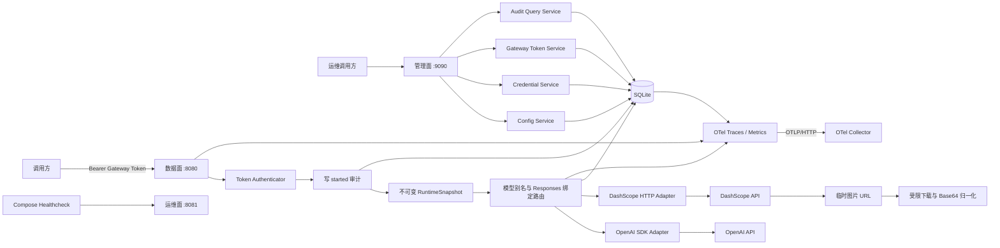
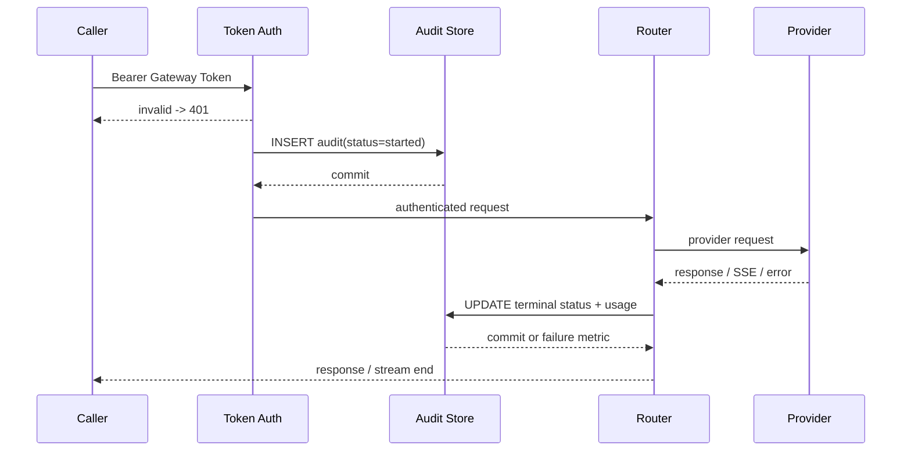

# AI 网关详细设计 02

- 文档版本：2.0
- 状态：已归档，用户评审通过
- 创建日期：2026-07-15
- 归档日期：2026-07-15
- 最后验证日期：2026-07-16
- 上一版本：[AI 网关详细设计 01](./design_01.md)
- 变更输入：[Input 05](../chat/input_05.md)
- 历史输入：[Input 01](../chat/input_01.md)、[Input 02](../chat/input_02.md)、[Input 03](../chat/input_03.md)、[Input 04](../chat/input_04.md)

## 1. 前置说明

### 1.1 本次交付范围

本文是版本 01 的完整替代设计基线，不是对原文件的原地补丁。版本 01 保持冻结归档，版本 02 在其基础上新增或调整以下能力：

1. 新增 `POST /v1/responses`，OpenAI 使用官方 Go SDK，DashScope 使用自建 HTTP 适配器。
2. 新增独立的 Provider 密钥管理和 Gateway Token 管理，不建立用户、角色、租户或权限关系。
3. 使用 SQLite 统一保存配置 Revision、密钥密文、Gateway Token、Responses 绑定、调用审计和管理事件，替代 bbolt。
4. 按 Gateway Token 记录、查询和汇总调用审计，同时保存模型输入、输出、缓存与推理 Token 用量。
5. 手写生产代码的单元测试覆盖率必须不低于 90%，关键包必须不低于 95%。
6. 新增无公网、无真实 Provider Key 的 Mock E2E。
7. 接入 OpenTelemetry，通过 OTLP 暴露网关自身 HTTP、Provider、Token 用量、SQLite、审计和配置指标及 Trace。
8. 提供 Docker Compose 部署设计，并在 Compose YAML 中配置健康探针。

本轮只归档设计和需求原文，不创建 Go 源码、OpenAPI 文件、Compose 文件或数据库。因此当前没有可执行的构建、覆盖率、E2E、容器启动或 OTel 导出结果。第 18 节定义实现后的强制验证门槛；用户完成本版评审前不进入实现阶段。

### 1.2 指令冲突与偏差说明

最新用户指令优先于版本 01 和会话级指南中的旧结论，具体偏差如下：

| 旧结论 | 版本 02 处理 | 原因 | 影响范围 | 回滚 |
| --- | --- | --- | --- | --- |
| Responses API 是非目标 | 废弃，新增 Responses Create | 用户明确要求 | Schema、路由、Provider、审计、测试 | 删除 Responses Route 与 Handler，调用方退回 Chat |
| 不建设密钥管理 | 废弃，增加独立密钥存储 | 用户明确要求 | Bootstrap、SQLite、管理 API、Provider Client | 恢复环境变量注入，删除密钥表前先导出并切换 |
| 数据面无调用 Token | 废弃，增加 Gateway Token | Token 粒度审计必须先识别调用凭证 | 全部数据面接口产生不兼容变更 | 临时关闭 Token 鉴权会同时失去 Token 审计，不建议 |
| bbolt 保存 Revision | ADR-03 被 ADR-05 取代 | 调用记录和审计需要简单 SQL 查询 | 全部持久化适配器 | 版本 02 尚未实施，无数据迁移；设计回退直接采用版本 01 |
| 不引入 OpenTelemetry | 废弃，采用 OTel SDK 与 OTLP | 用户明确要求 | 观测、HTTP Transport、Compose | YAML 设置 `enabled: false`，业务调用保持可用 |
| 禁止 Prometheus/OpenTelemetry 体系 | 仅覆盖其中的 OTel 禁令；仍不引入 Prometheus | 用户只要求 OTel，且强调网关指标 | 观测模块 | 禁用 OTel；无 Prometheus 迁移项 |

版本 02 只保留完成密钥管理和 Token 调用所必需的保护：随机密钥、摘要校验、静态加密、日志脱敏和管理监听隔离。不增加用户系统、RBAC、租户、mTLS、WAF、内容审核或配额系统。

### 1.3 工具降级、影响与回滚

- OpenAI 官方文档 MCP 已存在于本机配置，但当前会话未热加载。本轮按技能要求降级为 OpenAI 官方开发者站点和官方 `openai-go` 仓库只读检索。影响仅为资料获取通道；后续会话加载 MCP 后可复核本文 E-01～E-03。
- Context7 用于复核 OpenTelemetry Go 和 `modernc.org/sqlite` 文档；其结果再由官方仓库、官方包文档和 SQLite 官网交叉验证。
- 本地 `go list -m ...@latest` 因受限网络代理不可达而失败，没有写入项目依赖。依赖版本改由官方 Release、Tag 和包文档确认；实施前必须在获准联网环境再次验证并写入 `go.mod`、`go.sum`。
- 当前会话没有专用 Markdown 编辑 MCP，因此按执行指南降级为 `apply_patch`，仅新增本文件和 `docs/chat/input_05.md`。回滚时只删除这两个新增文件；工作区不是 Git 仓库，不能依赖 Git 回滚。
- 复杂设计使用结构化计划、Sequential Thinking 和任务管理器留痕。它们只影响分析与实施任务清单，不修改项目运行状态。

### 1.4 术语消歧

本文中的两个 “Token” 含义不同，禁止混用：

| 术语 | 含义 | 示例用途 |
| --- | --- | --- |
| Gateway Token | 网关签发给调用方的 Bearer 凭证，也是审计主体 | 鉴权、查询自身信息、按 `gateway_token_id` 查询审计 |
| Usage Token | 模型 Provider 返回的输入、输出、缓存、推理 Token 数量 | 用量统计、OTel 指标、审计汇总 |

“Token 粒度审计”指以 Gateway Token 为主键检索每次调用，并汇总该凭证消耗的 Usage Token。Gateway Token 不绑定用户。

### 1.5 假设、时效与不确定性

- 运行形态仍为独立 Go 服务，单实例写控制面，数据面、管理面和运维面在同一进程的不同监听地址。
- SQLite 文件只挂载到单个网关实例和本机文件系统；不放在 NFS 等网络文件系统，也不被多个容器同时写入。
- 管理面由部署网络隔离，默认只映射到宿主机 Loopback。本版不实现管理用户鉴权。
- Provider API Key 可通过管理 API 写入，也可在首次启动时从 Docker Secret 文件导入；明文不进入 YAML、日志、Trace 或审计。
- Responses 首版指 Create API 的同步和 SSE 能力。Background、WebSocket、Webhook、Conversation 资源、Retrieve/Delete/Cancel 等资源 API 不在本版范围内。
- 外部资料均于 2026-07-15 核验。Provider 字段、模型名、SDK 和 OTel 语义约定仍可能变化；实现必须锁定版本并用契约测试阻止无审查升级。
- DashScope 官方文档说明 `previous_response_id` 当前有效 7 天。网关默认以 7 天作为跨 Provider 的公共绑定保留期；上游提前失效仍可能返回错误。

## 2. 版本差异与兼容性

### 2.1 变更矩阵

| 能力 | 版本 01 | 版本 02 | 兼容性 |
| --- | --- | --- | --- |
| Chat Completions | OpenAI、DashScope，同步和 SSE | 保留 | 请求结构兼容，新增 Gateway Token 鉴权 |
| Responses | 不支持 | 两个 Provider，同步和 SSE | 新增 |
| Images Generations | 两个 Provider，统一 Base64 | 保留 | 请求结构兼容，新增 Gateway Token 鉴权 |
| Models | 匿名查询配置别名 | 使用 Gateway Token 查询可用别名 | 鉴权不兼容 |
| Token 查询 | 无 | 调用方查自身元数据；管理面签发、列出和读取密文中的明文 | 新增 |
| Provider Key | 环境变量引用 | SQLite 加密存储，Backend 引用 `credential_id` | YAML 不兼容 |
| 配置存储 | bbolt | SQLite | 存储不兼容，直接替换 |
| 调用记录 | 结构化日志 | SQLite 审计记录加结构化日志 | 新增 |
| Token 审计 | 无 | 明细、筛选、时间分组和用量汇总 | 新增 |
| 本地指标 | `expvar` | OTel HTTP/GenAI/自定义指标，经 OTLP 导出 | 观测接口不兼容 |
| 部署 | 未定义 Compose | Compose、命名卷、Secret、健康探针、OTel Collector | 新增 |
| E2E | 本地假服务计划 | 独立 Mock Provider 加 Compose E2E | 增强 |
| 单测覆盖率 | 总体不低于 90% | 明确分母、总门槛 90%、关键包 95% | 增强 |

### 2.2 不兼容改动

1. `POST /v1/chat/completions`、`POST /v1/responses`、`POST /v1/images/generations`、`GET /v1/models` 和 `GET /v1/token` 都要求 `Authorization: Bearer <Gateway Token>`。
2. Backend Schema 删除 `api_key_env`，替换为 `credential_id`。
3. Route 的 `operation` 枚举从 `chat|image` 扩展为 `chat|responses|image`。
4. bbolt 文件和布局全部废弃；当前尚无实现数据，不提供 bbolt 到 SQLite 的迁移器。
5. `expvar` 不是版本 02 的稳定观测契约；指标改由 OTLP 导出。

迁移策略为“无迁移，直接替换”。原因是工作区当前没有代码、数据库或运行实例。若评审后已有版本 01 实现或真实 bbolt 数据，必须新建设计版本 03，补充一次性迁移器后才能实施。

### 2.3 保持不变的原则

- YAML 编写的 OpenAPI 3.1.0 仍是 HTTP 契约和配置 Schema 的单一事实源。
- Backend 和 Route 分离，`model` 仍是稳定模型别名。
- 管理写操作仍使用 Revision、`If-Match`、SQLite 事务和不可变 RuntimeSnapshot 原子切换。
- OpenAI Chat、Responses 和 Image 使用官方 Go SDK；DashScope 继续使用自建 `net/http` 适配器。
- 图片只向调用方返回 `data[].b64_json`。
- 不引入远端 CI/CD。

## 3. 目标、非目标与成功标准

### 3.1 功能目标

1. 对外提供以下 OpenAI 风格接口：
   - `POST /v1/chat/completions`。
   - `POST /v1/responses`。
   - `POST /v1/images/generations`。
   - `GET /v1/models`。
   - `GET /v1/token`。
2. 管理面提供配置、Backend、Route、Provider Credential、Gateway Token、审计明细和用量汇总 API。
3. Gateway Token 不依赖用户表即可完成调用鉴权和 Token 粒度审计。
4. SQLite 单文件保存全部必要控制面和审计状态，并支持一致性备份、迁移和重启恢复。
5. OTel 同时覆盖 HTTP Server、Provider Client、SQLite、审计、配置切换和 AI 用量。
6. Docker Compose 能在本机一次启动网关与 OTel Collector，并通过健康状态确认网关已经就绪。

### 3.2 非目标

- 用户注册、登录、角色、权限、组织、租户、Token Scope、配额和计费。
- OpenAI Responses 的 Background、WebSocket、Webhook、Conversation API、Response Retrieve/Delete/Cancel。
- 向调用方承诺所有 OpenAI 或 DashScope 私有工具和字段；只支持第 8 节明确的公共契约。
- Embeddings、Rerank、Audio、Video、Image Edit、图片流式生成。
- 多实例写控制面、共享 SQLite、跨主机高可用。
- Prometheus Server、Prometheus Exporter 或 `/metrics` 抓取端点。
- 保存提示词、消息正文、Responses 输出正文、图片 Base64 或 Provider 临时 URL。
- 远端 CI/CD。

### 3.3 SLO 与 SLI

| 指标 | 目标 | 口径 |
| --- | --- | --- |
| 网关可用性 | 月度不低于 99.9% | 网关自身不可达和 5xx；排除已确认 Provider 故障 |
| 路由额外时延 | Chat/Responses p99 不高于 20 ms | 总时延减上游时延，不含调用方网络传输 |
| 配置切换 | p99 不高于 100 ms | 管理请求进入到新 Revision 对新请求可见 |
| Token 鉴权额外时延 | p99 不高于 2 ms | SQLite 热缓存下的摘要查验 |
| 审计前置完整性 | 100% | 所有已认证并准备调用上游的请求，必须先有 `started` 记录 |
| 审计终态收敛 | 100%，最长 15 分钟 | `succeeded|failed|cancelled|abandoned`，含流式中断修复 |
| 图片输出一致性 | 100% | 成功响应只包含非空 `b64_json`，不含 URL |
| OTel 业务隔离 | 100% | Collector 不可用不得阻断鉴权、审计或 Provider 调用 |
| Compose 就绪 | 本机 60 秒内 | `docker compose up --wait --wait-timeout 60` 成功 |
| 单元测试覆盖率 | 手写生产代码不低于 90% | 第 18.2 节固定分母 |

Provider 总时延不纳入网关自身 SLO，但必须通过审计和 OTel 单独记录。

### 3.4 可量化验收

- OpenAI 和 DashScope 各通过 Chat 同步/SSE、Responses 同步/SSE、Images 同步契约测试。
- Responses 的 `previous_response_id` 在 Backend 动态切换后仍路由到原 Backend；其他 Gateway Token 使用该 ID 返回 404。
- Gateway Token 创建、查询、读取 Secret、轮换、吊销、过期和最后使用时间全部可测。
- 每个成功、失败、取消和流式中断调用都能按 `gateway_token_id` 查询；汇总值与 Provider `usage` 一致。
- SQLite 重启后恢复配置、凭证、Token、绑定和审计；`PRAGMA integrity_check` 返回 `ok`。
- Mock E2E 不访问公网，不使用真实 Key，重复运行结果一致。
- OTel 测试导出器收到规定的指标和 Span，任何信号均不包含原始 Token、API Key、提示词或 Base64。
- Compose Gateway 容器最终为 `healthy`；破坏数据库路径或配置后为 `unhealthy`。

## 4. 架构决策

版本 01 的 ADR-01（YAML OpenAPI 单一事实源）和 ADR-02（Revision CAS 与不可变快照）继续有效。ADR-03 被本节替代。

### 4.1 ADR-04：支持 Responses Create，并固定续接 Backend

日期：2026-07-15｜状态：通过

背景：Responses 通过 `previous_response_id` 维护多轮上下文；若每一轮都按当前活跃 Backend 重新路由，上游 ID 对另一个 Provider 或 Backend 无效。

备选方案：

- 原样透传上游 ID：实现简单，但泄漏 Provider 形态，动态切换会破坏续接，也不能限制跨 Token 使用。
- 网关保存完整响应正文：可自建上下文，但增加隐私、容量和协议重放复杂度。
- 只保存 ID 映射并固定 Backend：存储最少，仍使用 Provider 上下文能力。

决策：网关生成公共 `resp_` ID，只保存公共 ID、上游 ID、Gateway Token、Backend、模型别名、Revision 和到期时间。后续调用必须使用同一 Gateway Token 和模型别名，并固定到原 Backend。

后果：动态 Backend 切换只影响新会话，不影响续接。映射过期或上游 ID 失效时返回稳定错误；不保存响应正文。

### 4.2 ADR-05：用 SQLite 替代 bbolt

日期：2026-07-15｜状态：通过，替代 ADR-03

备选方案：

- bbolt 加独立审计文件：依赖少，但筛选、聚合和跨实体事务需要自建索引。
- 外部 PostgreSQL：查询强，但超出单机、简单部署目标。
- SQLite：单文件、事务、索引和聚合足够，适配单实例。

决策：使用 `database/sql` 和纯 Go `modernc.org/sqlite`。配置 Revision、凭证、Gateway Token、Responses 绑定、调用审计和管理事件位于同一数据库。启用 WAL、`synchronous=FULL`、Foreign Key 和 Busy Timeout；所有写操作通过进程内写协调器串行化。

后果：读写并发优于单一 KV 写锁，审计查询简单；仍只允许一个网关实例写同一文件，且数据库不得位于网络文件系统。

### 4.3 ADR-06：密钥与 Gateway Token 独立于用户

日期：2026-07-15｜状态：通过

决策：

- Provider Credential 是独立资源，Backend 只引用 `credential_id`。
- Gateway Token 是独立调用凭证，不含 `user_id`、`role`、`tenant_id` 或 Scope。
- Provider Key 和可读取的 Gateway Token Secret 使用 AES-256-GCM 加密；Gateway Token 同时保存 SHA-256 摘要用于鉴权。
- 主密钥只从文件加载，不进入 SQLite 或 YAML 值。

后果：满足无用户系统的 Token 审计。由于用户明确要求 Token 可从 API 查询，网关必须保存其加密密文；管理面读取 Secret 的行为会记录不含明文的管理事件。

### 4.4 ADR-07：OTel 通过 OTLP 导出，不提供 Prometheus 端点

日期：2026-07-15｜状态：通过

决策：使用 OpenTelemetry Go SDK、`otelhttp` 和 OTLP/HTTP Exporter。HTTP 使用稳定语义约定，GenAI 指标按锁定版本的实验性语义约定实现，网关特有指标使用 `ai_gateway.*` 命名。Compose 中运行 OTel Collector，并用 `debug` Exporter完成本地验证。

后果：观测后端可替换，网关不依赖 Prometheus。OTel 导出异步且失败开放，不参与就绪判定。指标禁止 `token_id`、`request_id` 等高基数维度；Token 粒度查询由 SQLite 提供。

### 4.5 ADR-08：Mock Provider 与 Compose E2E 分离

日期：2026-07-15｜状态：通过

决策：仓库内提供一个确定性的 Mock Provider 二进制，同时模拟 OpenAI 和 DashScope 的 Chat、Responses、Images、SSE、临时图片 URL、Usage 和故障。生产 Compose 不包含 Mock；E2E Overlay 才加入。

后果：E2E 无公网费用、可复现且可故障注入。Mock 只验证网关契约，不替代真实 Provider 的受控冒烟测试。

## 5. 总体架构



### 5.1 监听边界

| 监听 | 默认地址 | 用途 | Compose 暴露 |
| --- | --- | --- | --- |
| 数据面 | `0.0.0.0:8080` | 模型调用、模型和当前 Token 查询 | `8080:8080` |
| 管理面 | 本机 `127.0.0.1:9090`；容器内 `0.0.0.0:9090` | 配置、Credential、Token、审计 | `127.0.0.1:9090:9090` |
| 运维面 | `0.0.0.0:8081` | `/livez`、`/readyz`、`/healthz` | 不映射，仅容器内探测 |

管理面没有用户权限系统。Compose 通过宿主机 Loopback 映射限制访问；若部署方把该端口暴露到非受控网络，已超出本设计边界。

### 5.2 分层职责

| 层 | 职责 | 禁止事项 |
| --- | --- | --- |
| Transport | OpenAPI 解码、Bearer 提取、SSE 写出、错误序列化 | 不选择 Provider，不解密 Provider Key |
| Application | Token 鉴权、审计编排、Responses 绑定、路由、配置应用 | 不依赖具体 SDK 类型 |
| Domain | 规范化请求/响应、Token/审计状态、错误类型和小接口 | 不依赖 HTTP、SQL、OTel |
| Provider Adapter | SDK/HTTP 转换、SSE、Usage、Base64 归一化 | 不修改全局配置，不写审计 |
| SQLite Adapter | 迁移、事务、查询、备份和保留期清理 | 不调用 Provider |
| Crypto Adapter | 摘要、加解密和主密钥版本 | 不记录明文，不管理用户 |
| Observe | OTel、`slog` 关联、健康状态 | 不采集正文、原始 Token、Key 或 Base64 |

### 5.3 关键 Go 接口

接口定义在消费者包，使用构造函数注入，不向领域层暴露 SDK 或 `*sql.DB`：

```go
type TokenAuthenticator interface {
    Authenticate(ctx context.Context, rawToken string) (GatewayToken, error)
}

type CredentialStore interface {
    GetDecrypted(ctx context.Context, credentialID string) (ProviderCredential, error)
}

type AuditStore interface {
    Start(ctx context.Context, record AuditRecord) error
    Finish(ctx context.Context, result AuditResult) error
    Query(ctx context.Context, filter AuditFilter) (AuditPage, error)
    AggregateUsage(ctx context.Context, query UsageQuery) (UsageReport, error)
}

type ResponseBindingStore interface {
    Put(ctx context.Context, binding ResponseBinding) error
    Resolve(ctx context.Context, publicID, gatewayTokenID string) (ResponseBinding, error)
}

type ResponsesProvider interface {
    Create(ctx context.Context, request ResponsesRequest) (ResponsesResponse, error)
    CreateStream(ctx context.Context, request ResponsesRequest) (ResponsesStream, error)
}
```

所有接口方法的第一个参数必须为调用请求的 `context.Context`。流式对象必须显式 `Close`，并保证取消传播到上游 HTTP 请求。

## 6. Schema 驱动配置

### 6.1 YAML 单一事实源

`api/openapi/gateway.yaml` 仍使用 OpenAPI 3.1.0 和 YAML 编写，并同时定义：

- 数据面和管理面 HTTP 接口。
- `BootstrapConfig`：进程启动前必须知道、不可通过动态配置改变的本机参数。
- `GatewayConfig`：可通过管理 API 产生 Revision 的 Backend、Route、审计和容量参数。
- Credential、Gateway Token、Audit、Usage、错误和健康响应 Schema。

不得维护平行 JSON Schema。生成代码放入 `internal/api/gen`，生成文件禁止手改。严格 YAML 解码必须拒绝未知字段、重复 Key、多文档、未知 Tag 和不受控 Alias。

### 6.2 BootstrapConfig 示例

`configs/bootstrap.example.yaml` 的结构如下。Secret 文件路径可进入 YAML，Secret 值不得进入：

```yaml
api_version: gateway.ai/v1alpha2
kind: BootstrapConfig

listeners:
  data: 0.0.0.0:8080
  admin: 0.0.0.0:9090
  operations: 0.0.0.0:8081

storage:
  driver: sqlite
  path: /var/lib/ai-gateway/gateway.db
  max_open_connections: 8
  busy_timeout: 5s
  journal_mode: WAL
  synchronous: FULL

secrets:
  master_key_file: /run/secrets/ai_gateway_master_key
  master_key_version: 1

credential_imports:
  - credential_id: openai-primary
    provider: openai
    source_file: /run/secrets/openai_api_key
    import_policy: if_missing
  - credential_id: dashscope-primary
    provider: dashscope
    source_file: /run/secrets/dashscope_api_key
    import_policy: if_missing

initial_gateway_config: /etc/ai-gateway/gateway.yaml

observability:
  otel:
    enabled: true
    service_name: ai-gateway
    service_version: 0.1.0
    otlp_http_endpoint: http://otel-collector:4318
    insecure: true
    metric_export_interval: 10s
    trace_sample_ratio: 1.0
    cardinality_limit: 2000

health:
  ready_timeout: 500ms
  shutdown_grace_period: 30s
```

约束：

- `master_key_file` 解码后必须恰好 32 字节；支持原始 32 字节或 Base64 编码。
- `credential_imports` 只在对应 ID 不存在时执行。成功导入后只保存密文，不把 Secret 文件内容复制到配置 Revision。
- `journal_mode` 固定为 `WAL`，`synchronous` 固定为 `FULL`；Schema 使用 `const` 防止误配。
- `trace_sample_ratio` 范围 0～1；E2E 为 1.0，生产示例建议 0.1。
- OTel Endpoint 不可达不阻止启动或就绪。

### 6.3 GatewayConfig 示例

`configs/gateway.example.yaml` 是动态配置的可读初始值：

```yaml
api_version: gateway.ai/v1alpha2
kind: GatewayConfig

backends:
  - id: openai-main
    provider: openai
    base_url: https://api.openai.com/v1
    credential_id: openai-primary
    capabilities: [chat, responses, image]
    timeouts:
      request: 120s
      stream_idle: 30s

  - id: dashscope-cn
    provider: dashscope
    base_url: https://example-workspace.cn-beijing.maas.aliyuncs.com/compatible-mode/v1
    credential_id: dashscope-primary
    capabilities: [chat, responses, image]
    timeouts:
      request: 120s
      stream_idle: 30s

routes:
  - id: chat-default
    operation: chat
    model_alias: chat-default
    active_backend: openai-main
    targets:
      - backend_id: openai-main
        upstream_model: example-openai-chat-model
      - backend_id: dashscope-cn
        upstream_model: example-dashscope-chat-model

  - id: responses-default
    operation: responses
    model_alias: responses-default
    active_backend: openai-main
    targets:
      - backend_id: openai-main
        upstream_model: example-openai-responses-model
      - backend_id: dashscope-cn
        upstream_model: example-dashscope-responses-model

  - id: image-default
    operation: image
    model_alias: image-default
    active_backend: openai-main
    targets:
      - backend_id: openai-main
        upstream_model: example-openai-image-model
      - backend_id: dashscope-cn
        upstream_model: example-dashscope-image-model

audit:
  retention: 720h
  cleanup_interval: 1h
  abandoned_after: 15m
  cleanup_batch_size: 1000

responses:
  binding_retention: 168h

limits:
  request_body_bytes: 2097152
  max_backends: 100
  max_routes: 100
  chat_concurrency: 128
  responses_concurrency: 128
  image_concurrency: 4
  images_per_request: 4
  image_raw_bytes_per_response: 33554432
```

示例模型名只表示映射位置，不是模型推荐。实施时必须选择账号实际可用的模型，并由 Mock 契约和受控冒烟测试验证。

### 6.4 结构和语义校验

除 OpenAPI 字段校验外，激活候选配置前必须满足：

1. Backend ID、Route ID 和 `(operation, model_alias)` 唯一。
2. Route Target 引用的 Backend、Credential 必须存在且状态为 `active`。
3. Backend Capability 必须包含 Route Operation。
4. `active_backend` 必须出现在当前 Route Targets 中。
5. 每个 Target 都必须给出非空 `upstream_model`。
6. 至少存在一条 Chat、一条 Responses 和一条 Image Route。
7. Provider、Credential Provider 和 Base URL 区域必须匹配。
8. DashScope Responses 使用新的 `/compatible-mode/v1` Base URL，不接受即将废弃的旧 `/api/v2/apps/protocols/...` 路径。
9. `max_backends`、`max_routes` 同时限制运行时内存和 OTel 属性基数。
10. Image Route 不自动重试；Responses 续接请求不允许 Fallback。
11. 候选快照必须能使用每个引用的 Credential 构造 Provider Client，但不发起收费探测请求。

### 6.5 启动与动态配置

启动顺序：

1. 严格解析并校验 `BootstrapConfig`。
2. 加载主密钥，打开 SQLite，设置并读回 PRAGMA。
3. 在独占迁移锁内执行嵌入式、带校验和的 SQL Migration。
4. 按 `if_missing` 导入 Bootstrap Credential。
5. 若数据库没有配置 Revision，导入 `initial_gateway_config` 为 Revision 1。
6. 读取当前 Revision、解密引用 Credential、构造 RuntimeSnapshot。
7. 初始化 OTel Exporter；失败记录告警并使用可重试 Exporter/No-op，不阻止业务。
8. 启动三个监听；`/readyz` 通过后容器进入 Healthy。

动态配置仍使用 `If-Match` 和单调 Revision。SQLite 事务提交后才执行一次 `atomic.Store(candidate)`；进程若在两步之间退出，重启从最新已提交 Revision 重建。

## 7. HTTP API 契约

### 7.1 鉴权规则

数据面除健康接口外统一要求：

```http
Authorization: Bearer agw_<opaque-secret>
```

鉴权流程：

1. 限制 Authorization Header 长度为 512 字节，只接受一个 Bearer 值。
2. 计算 SHA-256 摘要并查询 `gateway_tokens.secret_sha256`。
3. 使用常量时间比较，检查 `active`、未过期、未吊销。
4. 将 `gateway_token_id` 放入请求 Context；原始 Token 立即丢弃。
5. 在解析和处理数据面请求前创建审计记录。

未认证请求返回 `401 invalid_gateway_token`，不进入按 Token 审计表，避免把猜测或攻击错误归因给某个合法 Token；只增加无 Token ID 的低基数错误指标。

### 7.2 数据面接口

| 方法与路径 | 用途 | Gateway Token | 流式 |
| --- | --- | --- | --- |
| `POST /v1/chat/completions` | Chat Completions | 必须 | SSE 可选 |
| `POST /v1/responses` | Responses Create | 必须 | SSE 可选 |
| `POST /v1/images/generations` | 图片生成并统一 Base64 | 必须 | 否 |
| `GET /v1/models` | 查询当前 Revision 可用模型别名 | 必须 | 否 |
| `GET /v1/token` | 查询当前调用 Token 元数据 | 必须 | 否 |

`GET /v1/models` 不调用 Provider，只返回当前快照中至少有一个可用 Target 的模型别名、能力和 `owned_by=ai-gateway`。Token 没有 Scope，因此所有 Active Token 看到同一模型列表。

`GET /v1/token` 只返回：

```json
{
  "id": "gtok_01K0EXAMPLE",
  "name": "local-client",
  "status": "active",
  "created_at": 1784102400000,
  "expires_at": null
}
```

该接口不返回 Secret；调用方已经持有用于发起本次请求的 Secret。

### 7.3 配置与 Backend 管理 API

版本 01 的配置 API 保留，存储实现改为 SQLite：

| 方法与路径 | 用途 | 乐观锁 |
| --- | --- | --- |
| `GET /admin/v1/config` | 当前配置、Revision 和摘要 | 无 |
| `PUT /admin/v1/config` | 全量替换配置 | 必须 `If-Match` |
| `GET /admin/v1/backends` | 列出 Backend | 无 |
| `PUT /admin/v1/backends/{backend_id}` | 新增或替换 Backend | 必须 `If-Match` |
| `DELETE /admin/v1/backends/{backend_id}` | 删除未引用 Backend | 必须 `If-Match` |
| `PUT /admin/v1/routes/{route_id}/active-backend` | 原子切换活跃 Backend | 必须 `If-Match` |
| `GET /admin/v1/revisions` | 分页列出 Revision | 无 |
| `GET /admin/v1/revisions/{revision}` | 读取历史配置 | 无 |
| `POST /admin/v1/revisions/{revision}/restore` | 复制历史配置为新 Revision | 必须 `If-Match` |

配置响应不得返回 Credential 密文或明文。

### 7.4 Provider Credential API

| 方法与路径 | 用途 | Secret 返回 |
| --- | --- | --- |
| `POST /admin/v1/credentials` | 创建 Credential | 否 |
| `GET /admin/v1/credentials` | 分页列出元数据 | 否 |
| `GET /admin/v1/credentials/{credential_id}` | 查询元数据和引用关系 | 否 |
| `POST /admin/v1/credentials/{credential_id}/rotate` | 以新 Key 原子轮换 | 否 |
| `DELETE /admin/v1/credentials/{credential_id}` | 删除未引用 Credential | 否 |

创建和轮换请求包含 `secret`，Transport 层完成大小限制后立即交给 Crypto Adapter；日志、错误和事件均不得序列化请求体。轮换在候选 Provider Client 构造成功后提交，失败保留旧密钥。

### 7.5 Gateway Token API

| 方法与路径 | 用途 | Secret 返回 |
| --- | --- | --- |
| `POST /admin/v1/tokens` | 签发 Token | 是，仅本次响应 |
| `GET /admin/v1/tokens` | 列出元数据 | 否 |
| `GET /admin/v1/tokens/{token_id}` | 查询元数据 | 否 |
| `GET /admin/v1/tokens/{token_id}/secret` | 从密文读取可调用 Secret | 是 |
| `POST /admin/v1/tokens/{token_id}/rotate` | 轮换 Secret，旧值立即失效 | 是，仅本次响应 |
| `POST /admin/v1/tokens/{token_id}/revoke` | 吊销 Token | 否 |
| `DELETE /admin/v1/tokens/{token_id}` | 删除无绑定依赖的已吊销 Token | 否 |

签发示例：

```http
POST /admin/v1/tokens HTTP/1.1
Host: 127.0.0.1:9090
Content-Type: application/json

{"name":"local-client","expires_at":null}
```

```json
{
  "id": "gtok_01K0EXAMPLE",
  "name": "local-client",
  "token": "agw_example-secret",
  "status": "active",
  "created_at": 1784102400000,
  "expires_at": null
}
```

所有包含 `token` 的响应设置：

```http
Cache-Control: no-store
Pragma: no-cache
```

`GET .../secret` 是为了满足“Token 可从 API 查询并用于调用”的明确要求。它只存在于管理监听，使用主密钥解密，并写入 `admin_events` 的 `token.secret_revealed` 事件；事件不含 Secret。

### 7.6 审计与用量 API

| 方法与路径 | 用途 |
| --- | --- |
| `GET /admin/v1/audits` | 按 Token、时间、操作、模型、Backend、状态筛选明细 |
| `GET /admin/v1/audits/{audit_id}` | 查询单条明细 |
| `GET /admin/v1/tokens/{token_id}/usage` | 按日、模型或操作汇总 Usage Token 和请求数 |

通用查询参数：

- `token_id`、`from`、`to`、`operation`、`model_alias`、`backend_id`、`status`。
- `cursor` 为不透明游标，`limit` 默认 100、最大 500。
- 时间使用 Unix 毫秒或 RFC 3339 输入，响应统一 Unix 毫秒。
- `group_by` 只能为 `day|model|operation`。

不提供任意 SQL、正文搜索或按提示词查询。

### 7.7 公共响应头

- `x-request-id`：请求唯一标识。
- `x-ai-gateway-revision`：本请求持有的配置 Revision。
- `x-ai-gateway-backend`：实际 Backend ID；模型列表和 Token 查询不返回。
- `x-ai-gateway-audit-id`：已创建的审计 ID。

响应头、日志和 Trace 均不得出现 Gateway Token Secret 或 Provider Key。

### 7.8 错误契约增量

沿用版本 01 的 OpenAI 风格错误结构，新增：

| HTTP | Code | 场景 |
| ---: | --- | --- |
| 401 | `invalid_gateway_token` | Token 缺失、摘要不匹配、已吊销或过期 |
| 404 | `response_not_found` | 公共 Responses ID 不存在、过期或不属于当前 Token |
| 409 | `credential_in_use` | 删除仍被 Backend 引用的 Credential |
| 409 | `token_has_response_bindings` | 删除仍有有效 Responses 绑定的 Token |
| 422 | `credential_invalid` | Credential Provider 不匹配或 Secret 为空 |
| 422 | `unsupported_responses_parameter` | Responses 字段不在公共契约中 |
| 503 | `audit_unavailable` | 无法创建调用审计，拒绝调用上游 |
| 503 | `storage_unavailable` | SQLite 不可用或迁移未完成 |

对外错误不得回显 Provider 原始响应体、SQL、密文或解密错误细节。

## 8. Responses API 设计

### 8.1 公共请求契约

`POST /v1/responses` 支持以下明确子集：

| 字段 | 类型 | 约束 |
| --- | --- | --- |
| `model` | string | 必须，是 `operation=responses` 的模型别名 |
| `input` | string 或 input item 数组 | 必须；支持文本消息和 Function Call Output |
| `instructions` | string | 可选 |
| `previous_response_id` | string | 可选，只接受网关 `resp_` ID |
| `stream` | boolean | 可选，默认 false |
| `max_output_tokens` | integer | 可选，1～配置上限 |
| `temperature` | number | 可选，0～2 |
| `top_p` | number | 可选，0～1；不能与 `temperature` 同时显式设置 |
| `reasoning.effort` | string | 可选，按目标模型 Capability 校验 |
| `text.format` | object | 可选，支持 `text` 和 JSON Schema Structured Output |
| `tools` | array | 可选，支持 `function`；内置工具按 Route Capability 显式开启 |
| `tool_choice` | string/object | 可选，与 `tools` 一致 |
| `parallel_tool_calls` | boolean | 可选 |
| `store` | boolean | 可选；有 `previous_response_id` 时必须为 true |

本版明确拒绝：

- `background=true`。
- `conversation`。
- WebSocket 传输。
- 未在 Schema 声明的 Provider 私有字段。
- 对目标 Provider 或目标模型未声明 Capability 的内置工具。

拒绝而不是静默忽略字段，避免 DashScope 官方“未列出字段可能被忽略”的行为造成调用方误判。

### 8.2 Provider 能力矩阵

| Provider | 同步 | SSE | `previous_response_id` | Function Tool | Background | 网关实现 |
| --- | --- | --- | --- | --- | --- | --- |
| OpenAI | 是 | 是 | 是 | 是 | 上游支持，网关暂不开放 | 官方 `openai-go/v3` |
| DashScope | 是 | 是 | 是，官方说明 ID 有效 7 天 | 按官方兼容字段 | 官方当前仅同步调用，网关不开放 | 自建 `net/http` |

内置工具不是 Route 的默认能力。后续若启用，YAML Target 必须声明具体工具名，Schema 和契约测试必须同时覆盖两个 Provider 的字段差异。

### 8.3 新会话路由

没有 `previous_response_id` 时：

1. 鉴权并创建 `started` 审计。
2. 读取一次 RuntimeSnapshot。
3. 用 `(responses, model_alias)` 找到 Route 和 Active Backend。
4. 把模型别名改写为 Target `upstream_model`。
5. 调用上游。
6. 收到上游 Response ID 后，在返回调用方前写入 `response_bindings`。
7. 将上游 ID 改写为网关 `resp_` ID，模型名改写回别名。
8. 完成审计并返回。

若绑定写入失败，即使 Provider 已成功也返回 `503 storage_unavailable`，避免把无法续接的公共 ID 返回给调用方。

### 8.4 续接路由

有 `previous_response_id` 时：

1. 使用 `(public_response_id, gateway_token_id)` 查询绑定。
2. 不存在、已过期或属于其他 Token 时统一返回 404。
3. 请求 `model` 必须与绑定的 `model_alias` 一致。
4. 忽略 Route 当前 `active_backend`，固定使用绑定的 Backend。
5. 绑定 Backend 已删除或 Credential 不可用时返回 `409 response_backend_unavailable`，不 Fallback。
6. 把公共 ID 改写为上游 ID后调用 Provider。
7. 新响应建立同一 Token、Backend 和模型别名的下一条绑定。

这样，运维动态切换 Backend 只影响新会话。

### 8.5 同步与 SSE 改写

同步响应完成后统一改写：

- 顶层 `id`。
- 顶层 `model`。
- `previous_response_id`，若上游返回。
- Usage 原样归一化为 `input_tokens`、`cached_input_tokens`、`output_tokens`、`reasoning_output_tokens` 和 `total_tokens`。

SSE 处理：

1. 使用 Provider Adapter 的类型化事件解码，不逐字节盲目代理。
2. 首个 `response.created` 到达后，先持久化绑定，再把其中的 ID 改为公共 ID并写给调用方。
3. 后续所有包含 Response ID 的事件都使用同一映射。
4. `response.completed` 或终止事件中的 Usage 更新审计。
5. 第一事件写出前允许新会话按 Route Fallback；写出后禁止切换。
6. 续接请求从始至终禁止 Fallback。
7. 调用方取消时关闭上游 Stream，审计状态为 `cancelled`。

### 8.6 Responses 重试

- OpenAI SDK 设置 `option.WithMaxRetries(0)`，统一由网关决定。
- 新会话在尚未获得上游 Response ID、尚未写出 SSE 事件时，连接错误、408、429、5xx 最多 Fallback 一次。
- 续接请求不重试到其他 Backend；对同一 Backend 的自动重试默认也关闭，避免重复工具执行。
- `background` 不开放，因此没有轮询、取消和 Webhook 重试状态。

### 8.7 绑定保留和清理

- 默认保留 168 小时，与 DashScope 当前 7 天有效期对齐。
- 绑定不保存输入、输出、工具参数或正文。
- 清理任务每小时分批删除到期绑定；删除 Gateway Token 前必须确认没有有效绑定。
- 上游提前失效时映射 Provider 错误为 `response_not_found`，并把绑定标记为 `upstream_expired`。

## 9. Provider 适配

### 9.1 能力矩阵

| Provider | Chat 同步/SSE | Responses 同步/SSE | Image 同步 | 上游图片 | 实现 |
| --- | --- | --- | --- | --- | --- |
| OpenAI | 是 | 是 | 是 | SDK `B64JSON` 或兼容 URL | 官方 `openai-go/v3` |
| DashScope | 是 | 是 | 是，限当前同步模型 | 临时 OSS URL 或兼容 Base64 | 自建 `net/http` |

两个 Adapter 都输出领域层统一的 Usage：

```text
input_tokens
cached_input_tokens
output_tokens
reasoning_output_tokens
total_tokens
```

Provider 未返回的细分值保存为 `NULL`，不得臆测为 0；`total_tokens` 只有在上游缺失而输入、输出都存在时才允许求和。

### 9.2 OpenAI Adapter

实施基线锁定为 `github.com/openai/openai-go/v3 v3.42.0`。当前官方 Release 页面和可读取的 Tag 内容确认该版本存在，并支持：

- `client.Chat.Completions.New`。
- `client.Chat.Completions.NewStreaming`。
- `client.Responses.New`。
- `client.Responses.NewStreaming`。
- `client.Images.Generate`。

版本 01 记录了未能在本轮官方 Release 页面复核的 v3.43.0。版本 02 以当前可核验的 v3.42.0 修正依赖基线；实施前再次查询 Go Module Proxy 和官方 Release，只能升级到经过契约测试的明确版本，禁止使用 `@latest`。

构造规则：

1. 从 Credential Service 取得短生命周期明文，创建不可变 SDK Client。
2. 显式设置 API Key、Base URL、共享 `http.Client` 和 `option.WithMaxRetries(0)`。
3. `http.Client.Transport` 使用 `otelhttp.Transport` 包装共享 Transport。
4. 每个 RuntimeSnapshot 只保存 Client，不保存可序列化明文。
5. SDK 错误转换为稳定领域错误，原始响应体不回显。
6. SDK Debug 日志保持关闭；即使后续开启，也必须验证 Authorization 已脱敏。

### 9.3 DashScope Chat 与 Responses Adapter

调用路径：

- Chat：`POST {base_url}/chat/completions`。
- Responses：`POST {base_url}/responses`。

实现规则：

1. 使用标准库 `net/http`、显式请求/响应结构体和 `json.Decoder`，不以 `map[string]any` 组装核心协议。
2. Header 为 `Authorization: Bearer <Provider Key>` 和 `Content-Type: application/json`。
3. SSE 解析器识别 `event:`、`data:`、空行边界和结束事件；单条事件和缓冲区都有上限。
4. Responses 只发送公共 Schema 中已验证的字段，避免上游静默忽略未知字段。
5. `previous_response_id` 使用绑定中保存的 DashScope 上游 ID。
6. Base URL 和 Credential 必须属于同一区域；配置激活时校验。
7. `http.Transport` 进程级复用，并由 `otelhttp.Transport` 包装。

### 9.4 Image Adapter 与 Base64 归一化

公开接口继续固定返回 `b64_json`：

- OpenAI SDK 若返回 `B64JSON`，先严格 Base64 解码验证大小和图片类型，再输出规范化 Base64。
- OpenAI 兼容旧模型或 DashScope 返回 URL 时，使用受限下载器立即下载，不把 URL 返回调用方。
- 下载器只允许 HTTPS；禁止重定向到 HTTP、Loopback、私网、Link-local 或非预期主机。
- DNS 解析结果和实际连接地址都必须校验；重定向每一跳重新校验。
- 原始图片累计不超过 `image_raw_bytes_per_response`；使用限长 Reader 和临时 Spool，禁止无界读入。
- 临时文件、图片字节和 Base64 不写 SQLite、日志或 OTel。
- Image 不自动重试，避免重复计费和重复生成。

受限下载是实现 Base64 契约的必要边界，不扩展为通用 URL 抓取能力。

### 9.5 超时、取消与优雅退出

- Handler 从请求 Context 派生 Backend Request Timeout。
- SSE 另有 Stream Idle Timeout，每收到一个完整事件重置。
- 调用方取消、服务关闭和 Deadline 必须传到 SDK 或 HTTP Request。
- 禁止 Adapter 使用 `context.Background()` 脱离请求。
- 优雅退出先停止接收新请求，再等待在途请求，最后依次 Flush OTel、关闭数据库。
- 审计终态写入使用原请求 Context 派生的短超时 Context；调用方取消后仍允许最多 2 秒完成本地终态更新，但不继续上游工作。

## 10. 密钥与 Gateway Token

### 10.1 资源模型

Provider Credential：

```text
credential_id
provider
name
status
cipher_version
key_version
secret_ciphertext
created_at
updated_at
rotated_at
```

Gateway Token：

```text
token_id
name
status
secret_sha256
secret_ciphertext
cipher_version
key_version
created_at
updated_at
expires_at
revoked_at
last_used_at
```

两个模型都没有 `user_id`、`tenant_id`、`role`、`scope` 或 `quota` 字段。

### 10.2 主密钥与信封格式

- 主密钥是 32 字节随机值，由 Docker Secret 或受控本地文件提供。
- 使用标准库 AES-256 和 `cipher.NewGCMWithRandomNonce`，让标准库生成并封装 96 位随机 Nonce。
- Additional Authenticated Data 固定编码为：

```text
ai-gateway:v1:<resource_type>:<resource_id>:<provider>:<key_version>
```

- 数据库保存 `cipher_version=1`、`key_version` 和包含 Nonce 的密文。
- 解密认证失败返回内部 `credential_decrypt_failed`，对外只暴露 `credential_unavailable`。
- 主密钥不得写入命令行参数、环境变量快照、日志、SQLite 或 OTel。

主密钥轮换由离线子命令完成：

```text
ai-gateway rotate-master-key --old-file <path> --new-file <path>
```

子命令要求停止网关，在单个 SQLite 事务中逐条解密、重加密并递增 `key_version`；任一失败整体回滚。轮换前必须执行一致性备份。

### 10.3 Gateway Token 生成和鉴权

- Secret 格式为 `agw_` 加 `crypto/rand.Text()` 结果；随机部分至少提供 128 位熵。
- `token_id` 使用独立、不可猜测的 `gtok_` ULID，不从 Secret 派生。
- 保存完整 Secret 的 SHA-256 摘要和 AES-GCM 密文。
- 鉴权只使用摘要，不在每次调用时解密。
- `last_used_at` 在审计 `started` 事务中更新，避免额外写事务。
- 摘要存在唯一索引；Token 轮换在一个事务内替换摘要和密文，旧 Secret 提交后立即失效。
- 吊销只改变状态并保留历史审计；物理删除只允许已吊销、无有效 Responses 绑定的 Token。

### 10.4 明文生命周期

允许出现明文的边界只有：

1. 管理 API 创建或轮换请求的受限 Body Buffer。
2. Crypto Adapter 的栈/堆内短生命周期 Byte Slice。
3. Provider Client 初始化所需值。
4. Token 创建、轮换或显式 Secret 查询响应。

实现应在可控位置及时 `clear` Byte Slice，但 Go 字符串和 SDK 内部复制无法保证物理擦除。本文不宣称进程内存可完全清除；主要保证不持久化到非加密字段、不记录、不遥测。

### 10.5 Credential 更新与 RuntimeSnapshot

Credential 创建或轮换流程：

1. 校验 ID、Provider 和 Secret 大小。
2. 用新 Secret 构造所有引用 Backend 的候选 Client，不发起 Provider 请求。
3. 加密 Secret。
4. SQLite 写事务内写入 Credential 和 `admin_events`。
5. 事务提交后原子替换 RuntimeSnapshot。
6. 若进程在提交后、快照替换前退出，重启从数据库重建新 Client。

删除仍被 Backend 引用的 Credential 返回 `409 credential_in_use`。

## 11. SQLite 持久化

### 11.1 驱动与连接

依赖锁定为 `modernc.org/sqlite v1.53.0`。该驱动兼容 `database/sql` 且不依赖 CGO，简化多阶段 Docker 构建。

实现构造的等价 DSN 为：

```text
file:/var/lib/ai-gateway/gateway.db
?_pragma=foreign_keys(1)
&_pragma=journal_mode(WAL)
&_pragma=synchronous(FULL)
&_pragma=busy_timeout(5000)
&_txlock=immediate
&_time_integer_format=unix_milli
&_timezone=UTC
&_dqs=false
```

实际 DSN 是一行；以上仅为可读展示。启动后必须查询并确认 `foreign_keys=1`、`journal_mode=wal`、`synchronous=2`，不接受驱动静默忽略 PRAGMA。

连接策略：

- `SetMaxOpenConns(8)`，可由 Bootstrap 在 1～32 范围内调整。
- 所有写用例通过一个进程内 `writeMu` 进入短事务。
- 读查询使用连接池和 WAL 快照，不获取 `writeMu`。
- Busy Timeout 默认 5 秒；超时映射为 `storage_busy`。
- 不启用 Shared Cache，不允许第二个网关进程写同一文件。

SQLite 官方说明 WAL 允许 Reader 与 Writer 并行，但仍只有一个 Writer；`synchronous=FULL` 在 WAL 下为每次提交增加同步，以获得断电持久性。本版优先审计完整性，不默认选择 `NORMAL`。

### 11.2 数据表

| 表 | 主键 | 关键字段 | 用途 |
| --- | --- | --- | --- |
| `schema_migrations` | `version` | `name, checksum, applied_at` | 迁移版本和防篡改校验 |
| `runtime_meta` | `key` | `value` | 当前 Revision、Store Version |
| `config_revisions` | `revision` | `config_json, sha256, operation, request_id, created_at` | 不可变配置历史 |
| `provider_credentials` | `credential_id` | 第 10.1 节字段 | Provider Key 密文 |
| `gateway_tokens` | `token_id` | 第 10.1 节字段 | 调用凭证、状态和摘要 |
| `response_bindings` | `public_response_id` | `gateway_token_id, backend_id, provider, model_alias, upstream_response_id, revision, expires_at, state` | Responses 续接 |
| `request_audits` | `audit_id` | 第 12.2 节字段 | 数据面调用明细 |
| `admin_events` | `event_id` | `action, resource_type, resource_id, request_id, result, trace_id, created_at` | 无用户主体的管理操作留痕 |

时间统一存 Unix 毫秒 `INTEGER`。规范化配置仍以 JSON 文本保存，因为它由 YAML Schema 解码后的结构体产生，可稳定计算 SHA-256；原始 YAML 注释不进入 Revision。

### 11.3 索引

至少创建：

```sql
CREATE UNIQUE INDEX idx_gateway_tokens_secret_sha256
    ON gateway_tokens(secret_sha256);

CREATE INDEX idx_request_audits_token_started
    ON request_audits(gateway_token_id, started_at DESC, audit_id DESC);

CREATE INDEX idx_request_audits_started
    ON request_audits(started_at DESC, audit_id DESC);

CREATE INDEX idx_request_audits_operation_model_started
    ON request_audits(operation, model_alias, started_at DESC);

CREATE INDEX idx_response_bindings_token_expires
    ON response_bindings(gateway_token_id, expires_at);

CREATE INDEX idx_response_bindings_expires
    ON response_bindings(expires_at);
```

所有动态值通过参数绑定，禁止拼接 SQL。排序字段和 `group_by` 使用枚举映射到固定 SQL 片段。

### 11.4 事务边界

| 用例 | 单事务内容 |
| --- | --- |
| 配置更新 | 比较当前 Revision、写新 Revision、更新 current Revision、写管理事件 |
| Credential 轮换 | 更新密文和版本、写管理事件 |
| Token 签发/轮换/吊销 | 更新 Token、写管理事件 |
| 审计开始 | 插入 `started`、更新 Token `last_used_at` |
| Responses 首个 ID | 插入 Binding；同步调用可与审计完成同事务 |
| 审计完成 | 状态、Usage、错误、时延和完成时间 |
| 清理 | 按主键批量删除到期 Binding 或审计，单批最多配置值 |

不得把 Provider 网络调用放在 SQLite 事务内。事务必须短小，并尊重调用 Context；一旦进入 Commit，不暴露半提交状态。

### 11.5 Migration

- SQL Migration 使用 `embed.FS` 随二进制发布，文件名为 `0001_initial.sql` 等。
- 每个 Migration 有编译期固定 SHA-256；数据库已有相同版本但校验和不同则拒绝启动。
- Migration 在 `BEGIN IMMEDIATE` 中按序执行；成功后写 `schema_migrations`。
- 不允许启动时部分迁移或自动降级。
- Schema 破坏性修改必须通过新表、复制、校验、重命名在同一 Migration 完成。

### 11.6 备份、恢复和完整性

- `ai-gateway backup --output <file>` 使用 SQLite Online Backup API 生成一致性副本，不在运行中只复制 `.db` 而遗漏 `-wal`。
- 发布前运行 `PRAGMA quick_check`；备份演练和定期维护运行 `PRAGMA integrity_check` 与 `PRAGMA foreign_key_check`。
- 恢复前停止网关，保留原数据库及 `-wal`、`-shm`，验证备份后原子替换数据库文件。
- 恢复后先完成 Migration 和完整性检查，再开放数据面。
- 数据库和备份包含加密 Secret；恢复仍需要对应主密钥版本。

### 11.7 保留期

- 审计默认保留 30 天。
- Responses Binding 默认保留 7 天。
- Config Revision 和管理事件默认不自动删除；由后续明确策略处理。
- 清理任务每小时运行，单批 1,000 行，批次间让出 Writer。
- 清理失败只记录日志和指标，不删除部分之外的数据，不影响新调用。

## 12. Token 粒度审计

### 12.1 写入时序



审计可用性是调用上游的前置条件。`started` 插入失败时返回 `503 audit_unavailable`，不调用 Provider。

### 12.2 AuditRecord 字段

| 字段 | 类型 | 说明 |
| --- | --- | --- |
| `audit_id` | text | `aud_` ULID |
| `request_id` | text unique | 数据面请求 ID |
| `gateway_token_id` | text FK | 审计主体 |
| `operation` | text | `chat.completions|responses.create|images.generate|models.list|token.get` |
| `model_alias` | text nullable | 请求中的稳定别名 |
| `backend_id` | text nullable | 实际 Backend |
| `provider` | text nullable | `openai|dashscope` |
| `config_revision` | integer nullable | 入口持有的 Revision |
| `public_response_id` | text nullable | Responses 公共 ID |
| `stream` | integer | 0/1 |
| `status` | text | `started|succeeded|failed|cancelled|abandoned` |
| `http_status` | integer nullable | 返回状态 |
| `upstream_status` | integer nullable | 上游状态 |
| `error_code` | text nullable | 稳定网关错误码 |
| `fallback_count` | integer | 新会话首事件前 Fallback 次数 |
| `input_tokens` | integer nullable | Provider Usage |
| `cached_input_tokens` | integer nullable | Provider Usage |
| `output_tokens` | integer nullable | Provider Usage |
| `reasoning_output_tokens` | integer nullable | Provider Usage |
| `total_tokens` | integer nullable | Provider Usage |
| `image_count` | integer nullable | 成功图片数 |
| `raw_image_bytes` | integer nullable | Base64 前字节数 |
| `started_at` | integer | Unix 毫秒 |
| `finished_at` | integer nullable | Unix 毫秒 |
| `duration_ms` | integer nullable | 总时延 |
| `upstream_duration_ms` | integer nullable | Provider 时延 |
| `time_to_first_token_ms` | integer nullable | 首个文本增量 |
| `trace_id` | text nullable | OTel Trace ID |

禁止字段：Authorization、Gateway Token Secret、Provider Key、请求体、提示词、消息正文、工具参数/结果、响应正文、临时 URL、Base64 和密文。

### 12.3 状态机

```text
started -> succeeded
started -> failed
started -> cancelled
started -> abandoned
```

终态不可再次变化。实现使用：

```sql
UPDATE request_audits
SET status = ?, ...
WHERE audit_id = ? AND status = 'started';
```

受影响行数不是 1 时记录一致性错误，不覆盖已存在终态。

### 12.4 同步与流式差异

- 同步：Provider 完成后先提交审计终态和 Responses Binding，再向调用方写成功响应。
- SSE：`started` 在 HTTP 200 和第一事件之前提交；最终事件或错误后更新终态。
- 调用方取消：停止上游并使用最多 2 秒的本地收尾 Context 写 `cancelled`。
- 进程崩溃：定时修复器把早于 `abandoned_after` 的 `started` 改为 `abandoned`，保留已知字段。
- SSE 终态写失败：流可能已发送，不能改写 HTTP 状态；记录 `ai_gateway.audit.write.failure` 和错误日志，修复器最终收敛。

### 12.5 用量汇总

`GET /admin/v1/tokens/{token_id}/usage` 返回：

```json
{
  "token_id": "gtok_01K0EXAMPLE",
  "from": 1784016000000,
  "to": 1784102400000,
  "group_by": "model",
  "totals": {
    "requests": 12,
    "succeeded": 11,
    "failed": 1,
    "input_tokens": 4200,
    "cached_input_tokens": 800,
    "output_tokens": 900,
    "reasoning_output_tokens": 120,
    "total_tokens": 5100,
    "images": 2
  },
  "groups": []
}
```

聚合只计算 Provider 明确返回的 Usage。若部分记录为 `NULL`，响应增加 `usage_incomplete_records`，避免把未知值当成 0。

### 12.6 管理事件

管理面没有用户主体，仍记录资源级事件：

- `credential.created|rotated|deleted`。
- `token.created|secret_revealed|rotated|revoked|deleted`。
- `config.updated|restored`。

事件只包含资源 ID、请求 ID、结果、Trace ID 和时间，不包含 Caller 身份或 Secret。该表用于运维留痕，不冒充用户审计系统。

## 13. OpenTelemetry 设计

### 13.1 初始化与导出

使用：

- `go.opentelemetry.io/otel` 和 `go.opentelemetry.io/otel/sdk`。
- `otlptracehttp` 和 `otlpmetrichttp`。
- `go.opentelemetry.io/contrib/instrumentation/net/http/otelhttp`。
- W3C Trace Context 和 Baggage Propagator。

初始化顺序：

1. 构造 Resource：`service.name`、`service.version`、`service.instance.id`。
2. 创建 OTLP/HTTP Trace Exporter 和 BatchSpanProcessor。
3. 创建 OTLP/HTTP Metric Exporter 和 PeriodicReader。
4. 注册 Cardinality Limit 和 Attribute Filter View。
5. 设置全局 TracerProvider、MeterProvider 和 Propagator。
6. 优雅退出时分别 `Shutdown`，总超时 5 秒。

Exporter 初始化失败时记录一次受控错误并使用 No-op Provider；运行期导出失败交给 SDK 重试/丢弃策略，不阻塞业务请求。

### 13.2 Trace

Span 层次：

```text
HTTP <method> <route>
├── ai_gateway.authenticate
├── ai_gateway.audit.start
├── ai_gateway.route
├── gen_ai.chat | gen_ai.responses | gen_ai.image
│   └── ai_gateway.image.download（仅 URL 图片）
└── ai_gateway.audit.finish
```

HTTP Server 和 Provider HTTP Client 由 `otelhttp` 生成标准 Span；领域层补充：

- `gen_ai.operation.name`。
- `gen_ai.provider.name`。
- `gen_ai.request.model`，使用已配置的上游模型。
- `gen_ai.response.model`，上游实际返回时记录。
- `gen_ai.usage.input_tokens`、`gen_ai.usage.output_tokens`。
- `ai_gateway.model.alias`、`ai_gateway.backend.id`、`ai_gateway.config.revision`。
- `ai_gateway.token.id` 只允许在 Trace 和结构化日志中出现，不作为指标属性。

默认不采集 `gen_ai.input.messages`、`gen_ai.output.messages`、工具定义、工具参数或正文。Bootstrap Schema 不提供打开正文采集的开关。

### 13.3 指标

| 指标 | 类型/单位 | 关键低基数属性 | 含义 |
| --- | --- | --- | --- |
| `http.server.request.duration` | Histogram / s | method、route、status | 数据/管理/运维 HTTP 时延 |
| `gen_ai.client.operation.duration` | Histogram / s | operation、provider、model | Provider 调用时延 |
| `gen_ai.client.token.usage` | Histogram / `{token}` | provider、model、`gen_ai.token.type` | 单次输入/输出 Usage Token |
| `ai_gateway.request.count` | Counter / `{request}` | operation、status、error.type | 网关请求数 |
| `ai_gateway.request.active` | UpDownCounter / `{request}` | operation | 当前在途请求 |
| `ai_gateway.provider.time_to_first_token` | Histogram / s | provider、backend、model | SSE 首 Token 时延 |
| `ai_gateway.route.fallback.count` | Counter / `{fallback}` | operation、from_provider、to_provider | 首事件前 Fallback |
| `ai_gateway.image.output.size` | Histogram / `By` | provider、model | Base64 前原始图片大小 |
| `ai_gateway.audit.write.duration` | Histogram / s | phase、result | 审计开始/完成写时延 |
| `ai_gateway.audit.write.failure` | Counter / `{failure}` | phase、error.type | 审计写失败 |
| `ai_gateway.sqlite.operation.duration` | Histogram / s | operation、result | SQLite 读写时延 |
| `ai_gateway.config.revision` | ObservableGauge / `1` | 无 | 当前 Revision |
| `ai_gateway.config.apply.count` | Counter / `{apply}` | result | 配置应用次数 |

GenAI 语义约定仍处于演进状态。实现固定语义约定版本并以契约测试锁定名称；升级必须通过新的设计版本说明指标迁移。

### 13.4 属性基数

允许的指标属性：

- 固定枚举：operation、provider、status class、error.type、stream。
- 配置有界：backend ID、model alias、upstream model；Schema 各限制最多 100。
- HTTP Route 使用模板，不使用实际 Path。

禁止的指标属性：

- Gateway Token ID 或 Secret。
- Request ID、Audit ID、Response ID、Trace ID。
- URL Query、临时图片 URL、任意错误文本。
- 提示词、消息、工具参数、Base64。

Metric Reader 的默认 Cardinality Limit 为 2,000；View 再删除不必要 HTTP Client 地址和 URL 属性。超过限制产生 SDK 自观测告警，而不是无界增长。

### 13.5 日志关联

继续使用 `log/slog` JSON Handler，不在本版接入仍为 Beta 的 OTel Log SDK。日志从 Context 提取：

- `trace_id`、`span_id`。
- `request_id`、`audit_id`、`gateway_token_id`。
- `operation`、`model_alias`、`backend_id`、`provider`、`config_revision`。
- 稳定 `error_code` 和数值时延/Usage。

日志字段遵循与审计相同的内容禁令。原始 Provider 错误只保留受控状态码和稳定上游错误码。

### 13.6 OTel 与业务隔离

- OTel 不参与 `/readyz`，Collector 关闭时网关仍可调用。
- Exporter 使用独立队列和超时，禁止在请求路径执行同步 Flush。
- OTel 初始化和 Shutdown 都必须可单测。
- 内存测试 Exporter/Reader 用于断言 Span、Metric 和敏感字段缺失。
- Token 粒度审计不能依赖采样 Trace；唯一事实源是 SQLite。

## 14. 健康检查与 Docker Compose

### 14.1 健康端点

| 路径 | 成功条件 | 失败码 | 是否调用 Provider/Collector |
| --- | --- | ---: | --- |
| `/livez` | 进程已启动且未进入关闭状态 | 503 | 否 |
| `/readyz` | Migration 完成、SQLite 可读、初始写测试成功、主密钥已加载、当前快照有效、审计 Store 可用 | 503 | 否 |
| `/healthz` | `/readyz` 的稳定别名 | 503 | 否 |

成功响应：

```json
{
  "status": "ready",
  "checks": {
    "sqlite": "ok",
    "migrations": "ok",
    "master_key": "ok",
    "runtime_snapshot": "ok",
    "audit_store": "ok"
  },
  "revision": 1
}
```

就绪检查只做带 500 ms 上限的本地读和状态检查，不在每次探针中执行 Provider 请求、OTLP Flush 或长事务。启动 Migration 的成功写和运行期最近一次审计写用于维护 `audit_store` 状态。

### 14.2 内置 Healthcheck 子命令

最终镜像为 Distroless 风格时可能没有 Shell、curl 或 wget。因此 Gateway 二进制必须提供：

```text
/app/ai-gateway healthcheck \
  --url=http://127.0.0.1:8081/readyz \
  --timeout=2s
```

子命令只在 HTTP 200 且响应 `status=ready` 时返回 0；DNS、连接、超时、非 200 或非法 JSON 返回非 0。

### 14.3 生产 Compose 设计

实现文件为 `deploy/compose.yaml`：

```yaml
name: ai-gateway

services:
  gateway:
    build:
      context: ..
      dockerfile: deploy/Dockerfile
    image: ai-gateway:0.1.0
    command:
      - serve
      - --bootstrap-config=/etc/ai-gateway/bootstrap.yaml
    ports:
      - "8080:8080"
      - "127.0.0.1:9090:9090"
    volumes:
      - gateway-data:/var/lib/ai-gateway
      - ../configs:/etc/ai-gateway:ro
    secrets:
      - ai_gateway_master_key
      - openai_api_key
      - dashscope_api_key
    environment:
      OTEL_EXPORTER_OTLP_ENDPOINT: http://otel-collector:4318
    restart: unless-stopped
    healthcheck:
      test:
        - CMD
        - /app/ai-gateway
        - healthcheck
        - --url=http://127.0.0.1:8081/readyz
        - --timeout=2s
      interval: 10s
      timeout: 3s
      retries: 5
      start_period: 10s

  otel-collector:
    image: otel/opentelemetry-collector:0.153.0
    command:
      - --config=/etc/otelcol/config.yaml
    volumes:
      - ./otel-collector.yaml:/etc/otelcol/config.yaml:ro
    restart: unless-stopped

volumes:
  gateway-data:

secrets:
  ai_gateway_master_key:
    file: ./secrets/ai_gateway_master_key
  openai_api_key:
    file: ./secrets/openai_api_key
  dashscope_api_key:
    file: ./secrets/dashscope_api_key
```

Compose Secret 在非 Swarm 模式下本质是只读文件挂载，不宣称提供外部 KMS。`deploy/secrets` 必须被 `.gitignore` 排除，示例仓库只提交 `.example` 文件。

网关不把 OTel Collector 作为 `service_healthy` 依赖，因为观测失败不能阻止业务。`docker compose up --wait` 仍会等待 Gateway 的 Healthcheck，并确认 Collector 容器处于 Running。

### 14.4 OTel Collector YAML

`deploy/otel-collector.yaml` 用于本地验证：

```yaml
receivers:
  otlp:
    protocols:
      http:
        endpoint: 0.0.0.0:4318

processors:
  batch: {}

exporters:
  debug:
    verbosity: basic

extensions:
  health_check:
    endpoint: 0.0.0.0:13133

service:
  extensions: [health_check]
  pipelines:
    traces:
      receivers: [otlp]
      processors: [batch]
      exporters: [debug]
    metrics:
      receivers: [otlp]
      processors: [batch]
      exporters: [debug]
```

生产环境可替换 Collector Exporter，但不得修改网关的 OTLP 协议契约。本文不绑定具体商业观测后端。

### 14.5 启动验证

实现后的标准命令：

```sh
docker compose -f deploy/compose.yaml config --quiet
docker compose -f deploy/compose.yaml up --build --wait --wait-timeout 60
docker compose -f deploy/compose.yaml ps
docker compose -f deploy/compose.yaml logs --no-color gateway
```

通过条件：

- `gateway` 为 `running (healthy)`。
- `otel-collector` 为 `running`。
- `GET /v1/models` 未带 Token 返回 401，带已签发 Token 返回模型别名。
- 停止 Collector 后，模型调用仍可执行，网关只记录导出失败。
- 把 SQLite Volume 改为不可写的负例中，Gateway 不进入 Ready。

## 15. Mock E2E

### 15.1 Mock Provider

`cmd/mock-provider` 是仅用于测试的 Go 二进制，不编入 Gateway 镜像。它提供：

| 路径 | 模拟能力 |
| --- | --- |
| `/openai/v1/chat/completions` | OpenAI Chat 同步/SSE |
| `/openai/v1/responses` | OpenAI Responses 同步/SSE/续接 |
| `/openai/v1/images/generations` | OpenAI `b64_json` |
| `/dashscope/v1/chat/completions` | DashScope Chat 同步/SSE |
| `/dashscope/v1/responses` | DashScope Responses 同步/SSE/续接 |
| `/dashscope/v1/images/generations` | DashScope 临时 URL |
| `/objects/{id}.png` | 固定小 PNG、过大体、错误 MIME 和重定向 |
| `/__mock/healthz` | Mock 健康 |
| `/__mock/scenarios/{name}` | 设置下一次调用的故障场景 |

Mock 响应必须确定性：

- 固定文本、固定 Usage、固定一像素或小尺寸 PNG。
- SSE 可以按字节边界拆分，验证解析器不依赖 TCP Chunk。
- 每个上游响应带唯一但可预测的 ID。
- `previous_response_id` 映射只在 Mock 内存中保存，重启可清空。
- 故障场景包括 401、408、429、500、慢响应、连接中断、畸形 JSON、畸形 SSE、缺失 Usage、图片过大和 URL 过期。

### 15.2 E2E Compose Overlay

`deploy/compose.e2e.yaml`：

- 新增 `mock-provider` 服务及 Healthcheck。
- 覆盖 Gateway Bootstrap Credential 为固定测试 Secret 文件。
- 覆盖初始 GatewayConfig，将两个 Provider Base URL 指向 Mock 的不同前缀。
- 把 OTel Export Interval 改为 1 秒、Trace Sample Ratio 改为 1.0。
- 使用独立项目名和临时命名卷，不读取开发者的生产数据卷。
- Gateway 在 Overlay 中等待 Mock `service_healthy`，但仍不等待 OTel Collector Healthy。

### 15.3 E2E 场景

| ID | 场景 | 断言 |
| --- | --- | --- |
| E2E-01 | Compose 启动 | `up --wait` 成功，Gateway Healthy |
| E2E-02 | 创建并查询 Gateway Token | Secret 可用于调用，元数据不含用户字段 |
| E2E-03 | 查询模型 | 三种能力别名完整，未认证为 401 |
| E2E-04 | OpenAI Chat 同步/SSE | 文本、模型别名、Usage、审计正确 |
| E2E-05 | DashScope Chat 同步/SSE | 协议转换、SSE 边界、审计正确 |
| E2E-06 | OpenAI Responses 同步/SSE | 公共 ID 改写、Usage、事件顺序正确 |
| E2E-07 | DashScope Responses 续接 | 动态切换后仍固定原 Backend |
| E2E-08 | 跨 Token 使用 Response ID | 返回 404，不泄漏绑定存在性 |
| E2E-09 | 双 Provider Images | 结果都只有可解码 `b64_json` |
| E2E-10 | 动态 Backend 切换 | 新请求使用新 Revision，在途请求不变化 |
| E2E-11 | Token 轮换和吊销 | 旧 Secret 立即失效，审计历史仍可查 |
| E2E-12 | 审计汇总 | 每条明细和 Token Usage 汇总与 Mock Usage 一致 |
| E2E-13 | 流式中断 | 状态为 failed/cancelled，或超时后 abandoned |
| E2E-14 | OTel | Collector Debug 日志出现规定 Trace 和指标名，无 Secret/正文 |
| E2E-15 | 重启持久化 | 配置、Token、Credential、审计、绑定在 Gateway 重启后恢复 |
| E2E-16 | 健康负例 | 破坏 SQLite 或配置后探针失败 |

### 15.4 E2E 执行

标准入口：

```sh
go test -tags=e2e ./test/e2e -count=1 -timeout=5m
```

测试 Harness 负责：

1. 使用唯一 Compose Project Name 启动 Overlay。
2. 等待 Healthcheck，不使用固定 Sleep。
3. 执行全部场景并保存容器日志摘要。
4. 无论成功失败都执行 `docker compose down --volumes --remove-orphans`。
5. 检查 Mock 调用计数，确认没有访问公网。

Mock E2E 与单元测试覆盖率分开计算，不能用 E2E 覆盖率掩盖缺失的单元测试。
